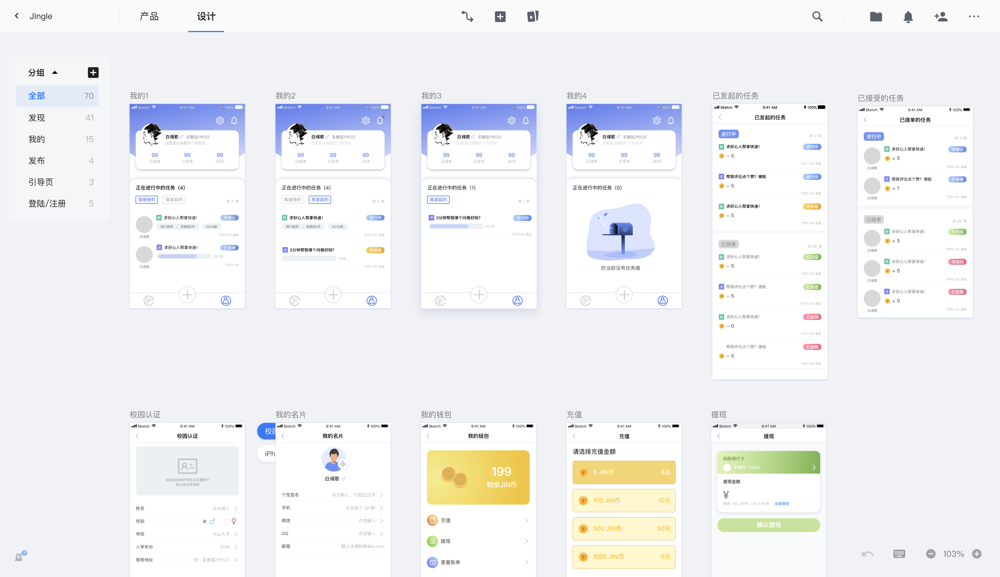
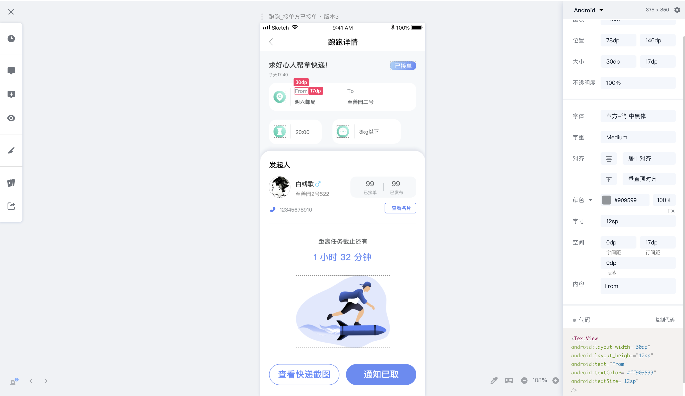

# Jingle高保真原型设计

### 1. Low Fidelity Prototype Design

在本项目中，我们在开发前先使用 Axure 制作了低保真原型，方便产品设计沟通和技术人员快速理解需求，并进行技术准备工作。

预览生成的html文件请参考 **LowFidelityPrototype** 文件夹。

#### Axure 简介

Axure RP是一款专业的快速原型设计工具。它让负责定义需求和规格、设计功能和界面的专家能够快速创建应用软件或Web网站的线框图、流程图、原型和规格说明文档。作为专业的原型设计工具，它能快速、高效的创建原型，同时支持多人协作设计和版本控制管理 。
Axure RP的使用者主要包括商业分析师、信息架构师、产品经理、IT咨询师、用户体验设计师、交互设计师、UI设计师等，另外，架构师、程序员也在使用Axure。

### 2. Low Fidelity Prototype Design

在完成低保真之后，设计人员开始制定 UI 设计规范，使用 sketch 进行了高保真原型及 UI 的设计，并通过蓝湖以及蓝湖 sketch 插件实时上传设计稿，方便客户端开发人员随时预览，下载切图，查看UI设计源代码，开展高效开发。

你可以点击下面的链接输入密码在线浏览 Jingle 的高保真 UI 设计：

[Jingle 高保真原型设计](https://lanhuapp.com/url/RFtA5 )   密码：jh0P

#### 部分页面

#### Sketch简介

Sketch 是一款适用于所有设计师的矢量绘图应用。矢量绘图也是目前进行网页，图标以及界面设计的最好方式。但除了矢量编辑的功能之外，sketch同样添加了一些基本的位图工具，比如模糊和色彩校正。对于绝大多数的数字产品设计，Sketch 都能替代 Adobe Photoshop，Illustrator 和 Fireworks。

 Sketch 是为图标设计和界面设计而生的。它是一个有着出色 UI 的一站式应用，所有你需要的工具都触手可及。在 Sketch 中，画布将是无限大小的，每个图层都支持多种填充模式；sketch有丰富的文字渲染和文本式样，还有一些强大的文件导出工具。

 

#### 蓝湖简介

蓝湖是一款产品文档和设计图的共享平台，帮助互联网团队更好地管理文档和设计图。蓝湖可以在线展示Axure，自动生成设计图标注，与团队共享设计图，展示页面之间的跳转关系。蓝湖支持从Sketch、Ps一键共享、在线讨论，而且蓝湖只需简单几步就能将设计图变成一个可以点击的演示原型，蓝湖还支持分享给同事，让他也可以在手机中查看设计效果。
