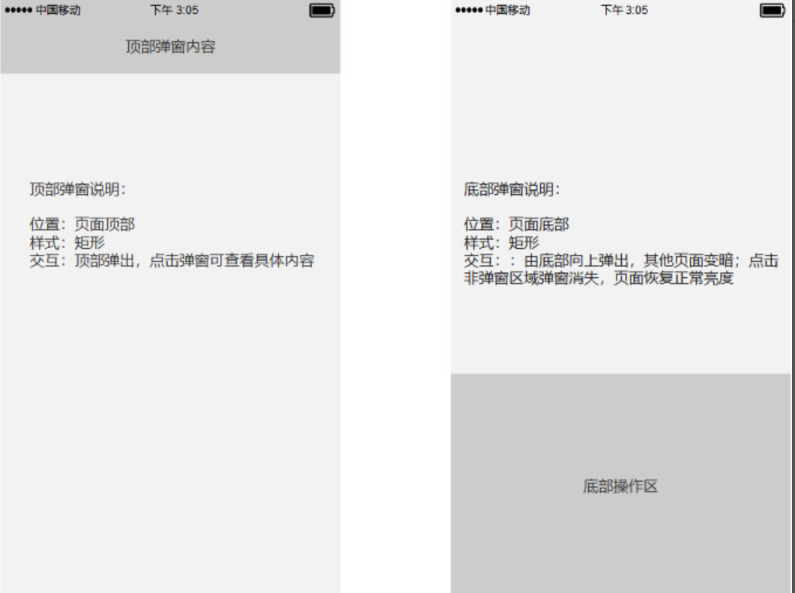

# Jingle 软件需求文档

## 〇、文档综述

### 0.1 PRD输出环境
| **文档版本号**   | **V2.0**   | **文档编号**   | **1**   |
|:----|:----|:----|:----|
| **所属小组**   | **细芬小组**   | **产品名称**   | **Jingle**   |
| **编写人**   | **白彧歌**   | **编写日期**   | **2019.5.18**   |

### 0.2 文档修订记录

| **文档版本**   | **修订日期**   | **属性** | **描述**   | **备注**   | **修改人**   |
|:----|:----|:----|-----|:----:|:----|
| V0.0   | 2019.4.14   | 新增   | 创建需求文档，撰写产品简介，确立产品结构雏型，确立大致需求     | 完成人员分工，进行准备工作   | 白彧歌   |
| V0.1   | 2019.4.18   | 修改   | 进一步修改产品结构，输出信息架构图和功能架构图     |    | 白彧歌   |
| v0.2   | 2019.4.25   | 修改   | 确立两大业务的基本流程，细化需求，确立了非功能性需求     |    | 白彧歌   |
| V1.0   | 2019.4.28   | 新增   | 输出低保真原型界面，确立各个页面交互方式和页面跳转流程     | 进入开发   | 白彧歌   |
| v1.1   | 2019.5.3   | 修改   | 修改低保真原形图，对部分需求进行优化     |    | 白彧歌   |
| v2.0   | 2019.5.18   | 新增   | 新增高保真原型图，对一些需求做了小部分修改细化     | 将高保真原型图上传至蓝湖，方便设计者和客户端开发者协作沟通   | 白彧歌   |

### 0.3 小组成员及分工

| **姓名**   | **学号**   | **负责任务**   | **贡献率**   |
|:----|:----|:----|:----|
| 白彧歌（组长）   | 16340003   | 产品设计，交互/UI设计，项目管理   | 16.7% |
| 王永杰 | 16340227 | API设计，软件设计文档 | 16.7% |
| 鞠擘 | 16340098 | 服务端开发部署 | 16.7% |
| 王培钰 | 16340220 | 数据库设计，需求规格说明 | 16.7% |
| 李杰泓 | 16340118 | 安卓端开发，包括安卓基本架构搭建，引导界面、登录注册、用户个人空间等页面实现。 | 16.7% |
| 吴啸林 | 16340241 | 安卓端开发，包括发现页面、发起页面、详情页面的实现 | 16.7% |

### 0.4 产品原型及UI设计

为了让阅读本文件的你快速了解我们的项目，这里提供了Jingle的原型设计
可参照文件夹 PrototypeDesign 中的 UI 设计文档

**低保真原型：**

Axure rp及html文件已上传至文件夹 PrototypeDesign

**高保真原型及视觉稿：**

高保真原型及视觉稿由 sketch 制作，已上传至蓝湖，你可以点击下面的链接输入密码在线浏览：

[Jingle 高保真原型设计](https://lanhuapp.com/url/RFtA5 )  密码:jh0P

## 一、概述

### 1.1  目的
本文档为“Jingle”的产品需求文档，主要作为确认需求以及系统分析设计的依据。

### 1.2 范围

此文档主要描述“Jingle”前端页面涉及到的功能点、以及部分交互细节。本文档主要读者为技术部门的开发人员、测试人员，以及视觉设计UI/交互设计UE等相关人员。

### 1.3背景介绍

移动互联网的兴起，迅速在社会大众，尤其是学生人群中产生了广泛的影响，为我们的生活方式带来了翻天覆地的变化。而互联网在校园生活中也有了越来越多的新的应用场景，原来遗留已久的很多校园生活难题轻松的被许多移动应用更好更快地解决。

作为一群在校大学生，通过观察身边同学以及结合自身生活经历，我们挖掘出一些大学生的痛点问题，主要概括为以下两点：
一方面是有的时候快递到了确不方便及时去取，也不好意思总是麻烦别人；
另外一方面是大学生经常需要做一些填问卷、举行投票、帮忙点赞等线上需要大量人参与的活动，尽管发了朋友圈，在各个群聊里发红包，但很快就淹没在各种消息中，最后也是收效甚微。

以这两点为出发点，我们设计了一款校园应用App“Jingle”，它针对于同一校园的在校大学生，基于校园实名认证的基础确保安全性。为同学之间完成跑腿任务、线上帮忙的交易提供了安全便捷的平台。
“Jingle”在英文中表示金币碰撞发出清脆声响。“找人帮忙，Jingle一下～”，在为同学们提供生活便利的同时挣点“小钱”，这正是 “Jingle”这款产品的主要用途。

同时我们也希望以后有机会将这款产品进一步社交化，平台化。增强用户和内容运营，提供更多实用有趣的功能，让 “Jingle 一下～” 真正成为陪伴大学生校园生活的好帮手。

### 1.4 产品简介

| **产品名称**   | Jingle   |
|:----|:----|
| **产品Slogan**   | 找人帮忙，Jingle一下～   |
| **产品定位**   | 一款针对于在校大学生，基于校园实名认证的互助赚钱app   |
| **产品描述**   | 通过Jingle,同一学校的在校大学生可以在基于校园实名认证的信任基础上   |
| **关键词**   | 大学生 互助 挣闲钱 跑腿    |
| **目标人群**   | 在校大学生   |
| **使用场景**   | 找人跑腿，找人线上帮忙，利用校园生活中的空余时间“顺便”挣闲钱   |

### 1.5 需求分析

| **场景**   | **目标用户需求**   | **对应功能**   |
|:----|:-----|:----|
| 有快递要取 / 有跑腿的活要做，但自己没时间，不好意思麻烦别人或因为某些原因不能做  | 需要提供一个平台，可以供同学**发起/接单 跑腿的任务**  | 发现-跑跑，发起任务-找人跑跑  |
| 在网上发起例如投票、点赞、问卷等活动，需要征集参与者。  | 需要提供一个平台，可以供同学**发起/接单 线上帮忙的任务**  | 发现-点点，发起任务-找人点点  |
| 没有太多的时间打工挣钱，想要在校的空余时间挣一点小钱  | 需要提供一种交易货币用于任务有偿交易，且该**虚拟货币**与现金挂钩，用户可以充值、提现  | 我的钱包  |
| 不放心把自己的快递和财物交给网上的陌生人  | 需要保证任务双方对于彼此身份都是**安全**的，便于交易沟通和责任划分。  目标人群是在校大学生，且任务具有地域性质，因此将可交易的范围锁定在同一校园的在校大学生。  | 校园认证机制  |
| 大多数情况下同一栋宿舍楼的人帮忙拿对双方更为方便  | 在 发现- 跑跑 中，尽可能为接单着**优先显示来自同一宿舍楼**的任务供其选择，更加“顺便”  | 发现-跑跑中置顶“来自同一楼栋”的任务列表  |
| 对于大多数线上任务，需要具有吸引力吸引更多的人参加  | 让点点任务更具有吸引力，除了任务发起这的内容本身外，在**赏金分配方式**上可以更有未知性，吸引大家都来赚取最高的赏金  | 在点点任务的发布中，发起者除了可以选择将赏金均分给接单着以外，还可以选择随机分配赏金的方式  |
| 需要在安全的基础上让交易双方了解彼此的联系信息，以保证更好完成任务。同时一定程度上满足同学对社交的要求。  | 用户的个人信息中应该保证一定的**联系方式**，还需要展现其**个性**。  同时在任务的各个阶段也要保证其个人信息公开给其他用户的程度是不同的。  | 我的名片中包括了用户自定义头像、个性签名，多个联系方式等  |

## 二、产品结构

### 2.1 信息架构图

### 2.2 功能结构图

## 三、总体业务流程图

### 3.1 跑跑任务（不考虑异常情况）

### 3.2 点点任务（不考虑异常情况）

## 四、全局说明

### 4.1 名词术语说明
| **名称**   | **说明**   |
|:----|:----|:----:|
| 跑跑   | 本款产品支持的两种任务类型之一，发起者通过发起“跑跑”任务，一对一召集接单人在当天截止时间前帮助自己完成取快递或者其他跑腿，送至自己的宿舍并对其支付报酬。     |
| 点点   | 本款产品支持的两种任务类型中的另一种，发起者通过发起“点点”任务，一对一或者一对多召集接单人在截止时间前帮助自己完成可以在线完成的任务，如公众号评论点赞评论、调查问卷、线上投票等任务，并在其回执完毕之后对其支付报酬。     |
| JIN币   | 本款产品交易过程中使用的虚拟币，1 JIN币 = 0.1 RMB。用户可以通过充值JIN币在任务平台进行交易。也可以在做任务赚钱后将JIN币提现至银行卡。     |
| 回执   | 当接单人完成发起人布置的任务后，需要通过向发起人发送回执来作为自己已完成任务的凭证，发起人查看并确认回执后双方之间的交易才能真正完成。     |

### 4.2 功能权限说明

由于本款产品基于校园实名认证的安全信任机制，并且包含有金钱交易操作，故对用户的身份认证有的较为严格的要求。具体的功能权限对应如下：

* 是否初次打开App：展示引导页，引导用户初步了解产品和，吸引其使用。
* 是否完成校园认证：注册时，除了常规的帐密设置外，用户还应该通过第二步的校园认证，否则注册失败。而第三步的个人名片填写则可先跳过之后填写。完成前2或3步注册流程后，可直接登陆账号进入app。
* 是否已登陆： 未登陆无法查看和使用本款App；登陆后可以查看任务列表、正常使用“我的”模块的功能。
* 是否完善联系方式：在保证“我的-设置-我的名片”中的联系方式至少为两种及以上（即至少保证有手机号码和注册邮箱）才可以进行任务的接单。
* 钱包中余额是否充足：钱包中的JIN币数不少于发布任务的赏金总额时，才可以正常发布任务。

至此，用户可享受本款产品的全部服务。

### 4.3 键盘说明

需要输入任何信息时，键盘均由屏幕底部向上弹出。

### 4.4 打断后重新打开App

* 锁屏后重新解锁：用户使用的页面。
* 切换到其它应用之后再切换回来：用户使用的页面。
* 后台关闭后：回到首页。
* 临时出现短信或来自其他应用的通知：不处理。

### 4.5 点击空白区域或无网络情况

| **操作**   | **响应**   |
|:----|:----|
| 点击空白区域   | 如果当前界面有键盘，则将键盘向下滑动藏   |
| 无网络时   | 部分页面弹出toast：“当前网络不可用，请检查网络设置”，时延：2s   |

### 4.6 页面内交互

#### 4.6.1 弹窗加载：

#### 4.6.2 提示信息

### 4.7 页面间交互

#### 4.7.1 发现页在屏幕上手指拖动左右滑动，可切换顶部标签栏中的“跑跑”和“点点”tab

### 4.8 页面异常

### 4.9 数据显示规范

| **名称**   | **格式**   | **示例**   |
|:----|:----|:-----|
| 任务发起、接单、完成时间  | **【当日】**  今天 HH(时) : MM(分)     **【其他】**  X(年） - Y (月）- Z(日）HH(时) : MM(分)  | 今天 17 : 40   今天 09 : 10     2019-06-30  17:40   2018-06-09 08:52  |
| 任务截止时间  | **【跑跑】**  今天 HH(时) : MM(分)     **【点点当日】**  今天 HH(时) : MM(分)     **【点点其他】**  X(年） - Y (月）- Z(日）HH(时) : MM(分)  | 同上   |
| 任务截止剩余时间  | **【不足一天】**  (H)H 小时 (M)M 分钟     **【超过一天】**  D 天 (H)H 小时 (M)M 分钟  | 9 小时 32 分钟   12 小时 9 分钟   0 小时 12 分钟     12 天 9 小时 32 分钟   3 天 0 小时 0 分钟  |
| JIN币金额  | 小数点后两位  | 0.12 JIN币   0.50 JIN币  |

### 4.10 任务状态命名及权限

#### 4.10.1 任务状态命名

#### 4.10.2 各状态对应权限

| 任务类型 | 对象   | 状态（id) | 权限                                                         |
| -------- | ------ | --------- | ------------------------------------------------------------ |
| 跑跑     | 发起方 | 待接单 0  | 自己发布的任务只能在“我的”查看，不会出现在“发现_跑跑“中      |
|          |        | 进行中 1  | 对方已接单，此时可以查看对方的信息（名片），同时应该将此任务从“发现”中移除，不能被其他人接单。  如果在回执前确认完成，则双方都跳转至“已完成状态”  |
|          |        | 待确认 2  | 对方发送回执后，查看其回执如果已经超过截止日期还未确认，状态仍然显示为“待确认”  |
|          |        | 已完成 3  | 钱发送至对方账户，双方仍能查看互相的信息还有回执内容。不能进行其他操作。 双方发送通知。  |
|          |        | 已超期 4  | 超期后钱退回账户，发起方发送通知。此时任务从“发现”移除       |
|          |        | 未按时 5  | 对方未按时完成，钱退回账户。双方发送通知                     |
|          | 接受方 | 待接单 0  | 能查看基本信息，不能看到发起方名片和快递界图                 |
|          |        | 已接单 1  | 已接单，此时可以查看对方的信息（名片），同时应该将此任务从“发现”中移除，不能被其他人接单。 已接单的任务只能在“我的”查看。  |
|          |        | 待确认 2  | 发送回执后，可以查看到自己的回执                             |
|          |        | 已完成 3  | 钱发送至账户，双方仍能查看互相的信息还有回执内容。 不能进行其他操作如果对方提前确认，则不能查看自己的回执。 双方发送通知。  |
|          |        | 未按时 5  | 未按时完成。双方发送通知                                     |
| 点点     | 发起方 | 待接单 0  | 自己发布的任务只能在“我的”查看，不会出现在“发现_跑跑“中      |
|          |        | 进行中 1  | 这时已经有第一个人接单并发送回执。可以在回执清单李查看其回执和个人信息。 如果是奖金随机分配，则将第一个数分配给他，之后依次类推  |
|          |        | 待确认 2  | 当回执数已满，将该任务从“发现“中移除，同时已接单却没有回执的接单用户状态全部变为“已超期”。 如果已经超过截止日期还未确认，状态仍然显示为“待确认”  |
|          |        | 已完成 3  | 钱发送至对方账户，双方仍能查看互相的信息还有回执内容。不能进行其他操作。双方发送通知。  |
|          |        | 已超期 4  | 超期后剩余的钱退回账户，发送通知。“发现”中移除任务。如果之前有人回执，则可查看回执清单  |
|          | 接受方 | 待接单 0  | 能查看基本信息，不能看到发起方名片                           |
|          |        | 已接单 1  | 已接单，此时可以查看对方的信息（名片），同时应该将此任务从接受方的“发现”中移除。 已接单的任务只能在“我的”查看。  |
|          |        | 待确认 2  | 发送回执后，可以查看到自己的回执                             |
|          |        | 已完成 3  | 钱发送至账户，仍能查看对方的信息还有自己的回执内容。不能进行其他操作 |
|          |        | 已超期 4  | 状态变更                                                     |

## 五、功能性需求说明

### 5.1 需求池&需求清单

#### 5.1.1 管理需求池

* 需求来源：PM
* 需求类型：新增需求、需求调整、功能优化、BUG修复、UI优化
* 系统：涉及到的系统及模块
* 需求说明：简述需求
* 优先级判断：重要紧急P1、重要但不紧急P2、紧急但不重要P3、既不紧急也不重要P4

| 需求来源   | 需求类型   | 系统   | 需求说明   | 优先级判断   |
|:----|:----|:----|:----|:----|
| PM（白彧歌）   | ...   | ...   | ...   | ...   |

#### **5.1.2 需求清单**
对需求管理池评估筛选后，将需求模块、对应功能、需求优先级、完成情况统一整理到下表，可得：

| 模块      | 功能                | 功能简述                                                | 关联功能                                              | 优先级 | 完成情况 |
| --------- | ------------------- | ------------------------------------------------------- | ----------------------------------------------------- | ------ | -------- |
| 引导页    | 引导页              | 引导新用户和长时间未使用的用户                          | 登陆                                                  | P4     | 已完成   |
| 登陆/注册 | 登陆                | 用户使用本产品的前置条件                                | 全部                                                  | P1     | 已完成   |
|           | 注册-注册账号密码   | 用户登录凭证                                            | 登陆                                                  | P1     | 已完成   |
|           | 注册-校园认证       | 安全保证，使用本产品的必要条件                          | 全部                                                  | P2     | 已完成   |
|           | 注册-个人资料       | 用于其他用户了解、联系                                  | 发现、发起任务、我的模块                              | P2     | 已完成   |
|           | 找回密码            | 找回忘记的密码，修改密码，保证安全                      | 登陆                                                  | P4     | 已完成   |
| 发现      | 发现页              | 帮助接单者发现待接单的任务                              | 发现模块全部功能                                      | P1     | 已完成   |
|           | 跑跑任务相关        | 跑跑任务从发起后到完成关于任务双方的全部流程            | 发现模块全部功能、已发起/接单任务列表、通知、个人主页 | p1     | 已完成   |
|           | 点点任务相关        | 点点任务从发起后到完成关于任务双方的全部流程            | 发现模块全部功能、已发起/接单任务列表、通知、个人主页 | P1     | 已完成   |
|           | 点点-回执清单       | 接单方单独批量确认回执的入口                            | 点点任务相关                                          | P1     | 已完成   |
| 发起任务  | 找人跑跑            | 发起跑跑任务                                            | 发现模块全部功能，个人主页，通知，已发起任务列表      | P1     | 已完成   |
|           | 找人点点            | 发起点点任务                                            | 发现模块全部功能，个人主页，通知，已发起任务列表      | P1     | 已完成   |
| 我的      | 个人主页            | 用户处理个人任务、通知、钱包、资料认证以及App设置的入口 | 全部                                                  | P1     | 已完成   |
|           | 设置                | 校园认证、个人资料及其他设置                            | 全部                                                  | P2     | 已完成   |
|           | 通知                | 用户接受任务相关及提现通知                              | 发现模块、我的钱包-提现                               | P2     | 已完成   |
|           | 已发起/接单任务列表 | 用户查看已发起/接单任务入口                             | 发现模块，发起任务模块                                | P1     | 已完成   |
|           | 我的钱包            | 提供给用户，用于对其JIN币账户进行查看和管理             | 发现、发起任务、我的模块                              | P1     | 已完成   |
|           | 我的钱包-充值       | 对JIN币进行充值                                         | 发起任务、我的模块                                    | P1     | 已完成   |
|           | 我的钱包-提现       | 对JIN币进行提现                                         | 我的模块                                              | P3     | 已完成   |

### 5.2 引导/启动页

| 页面名称   | 引导/启动页   |
|:----|:----|
| 入口   | ---   |
| 前置条件   | 第一次使用或长时间未使用产品   |
| 页面逻辑 | 用户在第一次使用产品或长时间未打开产品时，用于引导和提示用户产品功能，介绍产品特色，激发用户使用欲望 |
| 后置条件   | 进入登陆注册页   |
| 页面交互   | 用户点击“下一步”按钮（右箭头），切换至下一页，第三页继续点击进入登陆注册页面   |

### 5.3 登陆/注册页

---
#### **5.3.1 登陆**

（低/高保真原型图）

| 页面名称   | 登陆页   |
|:-----|:----|
| 入口 | --- / 引导页   |
| 前置条件 | 用户长时间未使用产品或退出登录   |
| 基本事件流 | 用户通过输入注册邮箱和密码登陆其账号使用本产品 |
| 后置条件 | 登陆成功/登陆失败重新登录   |
| 页面逻辑 | 1. 点击“立即注册”跳转至注册页面； 2. 点击“忘记密码”进入密码找回界面；  3. 点击“进入Jingle”，若成功登陆，则进入“发现-跑跑” |
| 页面交互 | 1. 用户输入注册邮箱和密码，点击“登陆”按钮，若成功直接跳转。失败则toast提示错误信息   |

#### 5.3.2 注册

（低/高保真原型图）

| 功能描述 | 注册 |
|:----:|:-----|
| 基本事件流 | 1. 账号密码设置 2. 校园认证 3. 个人资料设置（可先跳过） 4. 完成注册，并在注册完成后直接登陆进入App |
| 入口 | 登陆页 |
| 前置条件 | 第一次使用本产品 |
| 后置条件 | 注册成功/账号密码有错误，重新填写/校园认证失败，重新认证 |
| 页面逻辑 | 1. 点击“下一步”按钮进入下一页，点击“以后再说”、“完成”跳转提示注册完成 |
| 页面内交互 | 1. 创建账号时，要对输入邮箱、密码格式和邮箱是否已存在进行检查。 密码格式：6 - 12位，使用英文字母、数字、符号的组合； 2. 因为beta版测试主要针对中山大学学生，可在进入校园认证页面的学校栏，默认填入中山大学； 3. 填写名片的邮箱默认注册邮箱； 4. 前两步用户需全部填满信息，下方的“下一步”按钮才从不可点击的灰色变为蓝色可点击状态，填写名片页，只有用户填写手机号码以后，“完成”按钮才从不可点击的灰色变为蓝色可点击状态； 5. 更换头像点击头像打开手机相册上传头像。 |

## 5.4 发现页

---
### **5.4.1 跑跑**
**跑跑任务接单方页面流程**

| 功能描述 | 跑跑任务接单方 |
|:----:|:----|
| 基本事件流 | 1. 浏览任务列表   2. 查看任务详情   3. 接单任务   4. 查看快的截图，做任务   5. 任务完成，向任务发起方提供回执   6. 等待确认   7. 任务完成，赏金到账  |
| 入口 | 1.发现 2.我的 3. 我的-已接单任务列表 |
| 前置条件 | 有等待接单的跑跑任务在发现列表中 |
| 异常流程 | 任务未按时完成/任务超期 （参照4.10） |
| 页面逻辑 | 1. 在 发现- 跑跑中浏览待接单任务列表，点击其中一项进入该任务详情 2. 查看任务、赏金情况，点击接单按钮，页面状态变为“已接单”   3. 点击“查看快递截图”弹出截图图片，点击“查看名片”进入发起方名片页面，点击“通知已取”进入回执编辑页面   4. 点击发送，若发送成功跳转至反馈成功的页面；   5. 点击“返回任务详情”返回至任务详情页，页面状态变为“待确认”   6. 当发起方确认回执后，任务完成，页面状态改变为“已完成”  |
| 页面内交互 | 1. 接单后，页面状态变为“已接单”，显示任务倒计时。发起方信息下方新增“查看名片”按钮和发起方联系电话。 2. 编辑回执页面，点击编辑框左下角icon，可从相册中选择添加，并在该icon右侧显示当前添加图片数量，最多两张。添加的图片将把缩略图显示在编辑框右下角，点击缩略图上的“X"符号可以取消已添加的图片。 3.任务完成时，屏幕左下角会显示最终的交易情况。收到赏金显示“+”符号。  |
| 补充说明   | 用户接单时需判断用户是否已经填写手机号码，若未填写，则dialog提示用户先进入“我的-设置-我的名片”完善用户个人名片   |

**跑跑任务发起方页面流程**

| 功能描述 | 跑跑任务接单方 |
|:----:|:----|
| 基本事件流 | 1. 等待接单   2. 查看接单方回执   3. 查看并确认回执   4. 任务完成  |
| 入口 | 1.我的  2. 我的-已发起任务列表  |
| 前置条件 | 已发起跑跑任务，且该任务状态为“待接单” |
| 异常流程 | 任务未按时完成/任务超期 （参照4.10） |
| 页面逻辑 | 1. 点击“查看快递截图”弹出截图图片，点击“查看名片”进入接单方名片页面，点击“确认收到”跳转至确认支付的页面（发起方可忽略是否已经收到回执，适用于当面交接的使用场景）； 2. 点击“确认并支付”直接确认任务完成，跳转至确认支付页面。 3. 点击“确认并支付”确认任务完成，跳转至反馈成功的页面； 4. 点击“返回查看”返回至任务详情页，页面状态变为“已完成”。  |
| 页面内交互 | 1. 对方接单后，页面状态变为“进行中”，显示任务倒计时。接单方信息下方新增“查看名片”按钮和接单方联系电话。 2. 任务完成时，屏幕左下角会显示最终的交易情况。支付赏金显示“-”符号。  |

### 5.4.2 点点

**点点任务接单方页面流程**

| 功能描述 | 点点任务接单方 |
|:----:|:----:|
| 基本事件流 | 1. 浏览任务列表2. 查看任务详情3. 接单任务4. 做任务，保存回执图片5. 任务完成，向任务发起方提供回执6. 等待确认7. 任务完成，赏金到账 |
| 入口 | 1.发现 2.我的 3. 我的-已接单任务列表 |
| 前置条件 | 有等待接单的点点任务在发现列表中 |
| 异常流程 | 任务未按时完成/任务超期 （参照4.10） |
| 页面逻辑 | 1. 在 发现- 点点 中浏览待接单任务列表，点击其中一项进入该任务详情2. 查看任务、赏金情况，点击接单按钮，页面状态变为“已接单”3. 点击“查看名片”进入发起方名片页面，点击“通知对方已完成”进入回执编辑页面4. 点击发送，若发送成功跳转至反馈成功的页面；5. 点击“返回任务详情”返回至任务详情页，页面状态变为“待确认”6. 当发起方确认回执后，任务完成，页面状态改变为“已完成” |
| 页面内交互 | 1. 接单后，页面状态变为“已接单”，显示任务倒计时。发起方信息下方新增“查看名片”按钮和发起方联系电话。2. 编辑回执页面，点击编辑框左下角icon，可从相册中选择添加，并在该icon右侧显示当前添加图片数量，最多两张。添加的图片将把缩略图显示在编辑框右下角，点击缩略图上的“X"符号可以取消已添加的图片。3.任务完成时，屏幕左下角会显示最终的交易情况。收到赏金显示“+”符号。     |
| 补充说明 | 用户接单时需判断用户是否已经填写手机号码，若未填写，则dialog提示用户先进入“我的-设置-我的名片”完善用户个人名片 |

**点点任务发起方页面流程**

| 功能描述 | 点点任务发起方 |
|:----:|:-----|
| 基本事件流 | 1. 等待接单 2. 查看接单方回执 3. 批量 / 单独确认回执 4. 任务完成  |
| 入口 | 1.我的  2. 我的-已发起任务列表  |
| 前置条件 | 已发起跑跑任务，且该任务状态为“待接单” |
| 异常流程 | 任务超期 （参照4.10） |
| 页面逻辑 | 1. 点击“查看回执清单”进入回执清单列表，点击“查看名片”进入接单方名片页面；  **【单独确认回执】**   2. 在回执清单列表中，点击其中一项跳转至某一接单方回执详情，可查看该接单人回执内容和个人信息，点击“查看名片”进入接单方名片页面； 3. 在个人回执详情页中，点击“确认回执”直接确认该单个任务完成跳转至确认支付页面。  3. 点击“确认并支付”确认任务完成，跳转至反馈成功的页面； 4. 点击“返回查看”返回至该个人回执详情页，页面左下角显示赏金支付金额，右下角显示“已完成”状态；    **【批量确认回执】**   5. 在回执清单列表中，点击”选择全部按钮”，可批量选择多个未确认的接单方回执，选择完毕后点击“完成”，跳转至   6. 在个人回执详情页中，点击“确认回执”直接确认该单个任务完成跳转至确认支付页面。   7. 点击“确认并支付”确认任务完成，跳转至反馈成功的页面；   8. 点击“返回查看”返回至回执清单。点击已确认列表下的某项可跳转至该个人回执详情页。  |
| 页面内交互 | 1. 批量选择确认回执时，完成按钮会显示当前选择的人数   2. 批量选择的确认支付页面上方显示已选接单人的列表，点击“查看名片”可查看该接单人名片   3. 确认支付页面显示支付给接单人的赏金总额；   4. 回执详情页中，若该接单人已被确认，则页面左下角显示赏金支付金额，右下角显示“已完成”状态； 5.当待确认列表为空时，“选择确认回执”按钮变为灰色不可点击状态。  |

**回执清单空状态**

## 5.5 发起任务

---

（低/高保真原型图）

### 5.5.1 发起页

| 页面名称 | 任务发起页   |
|:----:|:----|
| 功能描述 | 1. 用户可选择“找人跑跑”来发布跑跑任务; 2. 用户可选择“找人点点”来发布点点任务。  |
| 入口 | ---   |
| 前置条件 | 户需要发布任务； |
| 后置条件 | 登陆失败/登陆成功重新登录 |
| 页面逻辑 | 1. 点击“找人跑跑”跳转至跑跑发起页；   2. 点击“找人点点”跳转至点点发起页；  |
| 补充说明 | 1.用户发起任务时需判断用户是否已经填写手机号码，若未填写，则dialog提示用户先进入“我的-设置-我的名片”完善用户个人名片 2. 用户发起任务时需判断用户钱包余额是否为零，若为零，则dialog提示用户先进入“我的-钱包-充值”进行JIN币充值。  |

### 5.5.2 找人跑跑

| 页面名称 | 跑跑发起页   |
|:-----|------|
| 功能描述 | 用户通过编辑任务内容和填写选择任务信息来来悬赏发布任务 |
| 基本事件流 | 1. 编辑任务内容；   2. 输入任务标题；   3. 输入地点；   4. 选择截止时间；   5. 选择快递重量范围（“3kg以下”、“3 - 5kg”、“5-10kg”、“10kg以上”）   6. 输入赏金； 7.确认完毕后发布任务。  |
| 入口 | 任务发起页   |
| 前置条件 | 1. 需要发起跑跑任务 2. 已填写电话   3. 钱包非空  |
| 后置条件 | 发起成功/发起失败重新登录   |
| 页面逻辑 | 1. 点击“发布”按钮，跳转至反馈成功的页面； 2. 点击“立即查看”按钮，跳转任务详情页，从任务详情页返回时跳转至“我的”。  |
| 页面交互   | 1.输入截止时间时，屏幕中央出现时间选择器，由于跑跑任务只限于当天完成，则只需提供小时、分钟的选择；   2.选择快递重量范围时，在输入框下方弹出选项列表。  |

### 5.5.3 找人点点

| 页面名称 | 点点发起页 |
|:-----|:-----|
| 功能描述 | 用户通过上传快递截图和填写选择任务信息来来悬赏发布任务 |
| 基本事件流 | 1. 上传快的截图； 2. 输入任务标题； 3. 选择截止时间； 4. 输入目标人数； 5. 输入赏金； 6. 选择赏金分配方式（“均分”、“随机”）   7.确认完毕后发布任务。  |
| 入口 | 任务发起页 |
| 前置条件 | 1. 需要发起点点任务  2. 已填写电话  3. 钱包非空   |
| 后置条件 | 发起成功/发起失败重新登录 |
| 页面逻辑 | 1. 点击“发布”按钮，跳转至反馈成功的页面； 2. 点击“立即查看”按钮，跳转任务详情页，从任务详情页返回时跳转至“我的”。  |
| 页面交互 | 1.输入截止时间时，屏幕中央出现时间选择器，由于点点任务不限于当天完成，则需提供年、月、日、小时、分钟的选择；  |

## 5.6 我的

#### 5.6.1 个人主页

| 页面名称 | 我的 |
|:----:|:-----|
| 功能描述 | 用户处理个人任务、通知、钱包、资料认证以及App设置的入口 |
| 入口 | --- |
| 页面逻辑 | 1. 点击“设置”icon，跳转至设置页； 2. 点击“通知”icon，跳转至通知页; 3. 点击金刚区内“已接单”，跳转至“已接单任务列表”；   4. 点击金刚区内“已发起”，跳转至“已发起任务列表”；   5. 点击金刚区内“JIN币”，跳转至“我的钱包”；  6. 点击正在进行中的任务列表中某一项，跳转至该任务详情页。  |
| 页面交互 | 1.在“正在进行中的任务”区域内，若同时有发起和接单的任务，则可点击“正在发起的任务”标题下方的tab进行切换。 2. “正在发起的任务”标题旁显示当前正在进行的任务数量；   3. 切换tab右侧显示当前“我发起/接单的”任务数量；   4. 当有未读的通知时，“通知”icon的右上角显示红点，当通知全部已读时，红点消失。  |

#### 5.6.2 通知页

| 页面名称 | 通知页 |
|:----:|:-----|
| 功能描述 | 用户查看通知的入口 |
| 基本事件流   | 1. 进入通知列表；  2. 查看通知详情 / 进入相应任务页面     |
| 入口 | 我的 |
| 页面逻辑 | 1. 通知共分为三种类型： “发起任务相关”、“接单任务相关”、“提现相关”，用三种不同颜色icon表示，位于每条通知左边便于用户区分； 2. 当通知类型为“发起任务相关”、“接单任务相关”时，用户点击某一条通知进入该任务详情页。   3. 当通知类型为“提现相关”时，用户点击某一条通知进入该通知详情页。  |
| 页面交互 | 1. 当用户点击某一条通知后，该通知移入下方已读区域，标题变为灰色，红点消失（变为已读状态）； 2.当用户点击“全部已读”按钮，全部未读通知变为已读状态；   3. 当通知列表无未读通知时，“全部已读”按钮变为灰色不可点击状态。  |

#### 5.6.3 设置页

| 页面名称 | 设置页 |
|:----:|:-----|
| 功能描述 | 用户进行设置及资料认证的入口 |
| 基本事件流 | 1. 进入设置页； 2. 校园认证 / 编辑我的名片/ 查看使用帮助 / 消息设置  |
| 入口 | 我的 |
| 页面逻辑 | 1. 点击“校园认证” 跳转至 校园认证页，可查看之前的认证情况； 2. 点击“我的名片”跳转至 我的名片页，可查看之前填写的个人资料；   3 . 校园认证 与 我的名片 信息编辑流程与注册时相同；   4. 点击“使用帮助”跳转查看 用户帮助页面；   5. 点击“消息设置”跳转至消息设置页。  |
| 页面交互 | 1. 当用户刚点击进入 校园认证页 和 我的名片页 ，下方按钮颜色为灰色，不可点击，当点击输入框进行编辑或修改头像并检测到内容更改后，下方按钮变为蓝色可点击状态，点击后修改； 2.当编辑更改内容后直接点击左上方返回icon，则放弃对信息进行修改。  |

#### 5.6.4  已发起/接受任务列表页

| 页面名称 | 已发起/接受任务列表页   |
|:----:|:-----|
| 功能描述 | 用户查看进行中和历史任务，浏览任务状态和收支情况的入口 |
| 基本事件流 | 1. 进入已发起/接受任务列表页； 2. 查看已发起/接受任务详情。  |
| 入口 | 我的 |
| 页面逻辑 | 1. 用户点击列表中某一项可进入该任务详情页； 2. 用户可以在列表中浏览每项任务任务收支情况（接单的点点任务如果正在进行中且赏金随机分配，则显示“+ ？”） 3 . 用户可以在列表中浏览每项历史任务的最终状态和进行中任务的当前状态； 4. 用户可以在列表中浏览每项任务中个人的发起/接单时间。  |

#### 5.6.5 我的钱包

（低/高保真原型图）

| 页面名称 | 我的钱包页 |
|:-----|:-----|
| 功能描述 | 提供给用户，用于对其JIN币账户进行查看和管理 |
| 基本事件流 | 1. 进入钱包可查看J账户IN币余额； 2. 点击“查看账单”，用户可查看自己的充值提现记录以及每项任务的收支情况；    **【JIN币充值】**   3. 进入充值页；   4. 选择需要充值的选项；   5. 确认支付；   6. 支付成功；      **【JIN币提现】**   7. 进入提现页；   8. 选择或绑定提现银行卡；   9. 输入提现金额或直接选择全部提现；   10. 点击确认提现；   11. 收到提现成功通知，提现完成。  |
| 入口 | 我的 |
| 后置条件 | 充值成功/充值失败/提现成功/提现失败 |
| 页面逻辑 | 1. 点击“查看账单”，跳转至账单页；    **【JIN币充值】**   2. 点击“充值”，跳转进入充值页；   3. 点击“确认支付”按钮，调出支付软件界面；   4. 若支付成功，跳转至成功反馈页面；   5. 若支付失败，跳转至失败反馈页面；   6. 点击“返回查看”按钮，跳转至 我的钱包页；    **  【JIN币提现】**   7. 点击“提现”，跳转进入提现页；   8. 若输入框非空且内容格式正确，点击“确认提现”按钮，跳转至成功发送提现请求的反馈页面   9. 点击“返回查看”按钮，跳转至 我的钱包页。  |
| 页面交互 | 1. 在“充值”页，当用户选中不同金额选项，左下方支付金额应该有相应变化； 2. 提现时，若用户之前未绑定银行卡，应在原显示银行卡位置提示用户先绑定银行卡；   3. 用户可以点击卡片右上方箭头打开银行卡列表选择已绑定的银行卡和添加新银行卡；   4. 应保证用户在提现金额输入框只能输入数字，并保证格式正确（小数点后最多两位）；  5.当用户点击 “全部提现”，对应的金额要自动添加在输入框；   6.用户点击确认提现时，应判断输入的金额是否小于等于全部余额；  |

## 六、非功能性需求说明

### 6.1 性能需求
* app启动时间不超过5秒
* app内操作的响应时间不超过3秒，在网络连接超时/弱网情况下，需给出相应提示并可重新加载
* 程序闲时没有异常的CPU占用，忙时没有异常的峰值占用
* 前端实现图片懒加载，节约用户流量，保障页面加载速度
* 并发能力要较高，系统必须顺畅运行

### 6.2 可用性需求
* 兼容性：需要 Android 4.4 或更高版本
* 容错性：程序应该通过不唐突的无模态反馈提醒用户录入时的状态，帮助用户校验，保证数据条目输入的有效性
* 状态可见：让用户了解自己处于何种状态
* 环境贴切：使用用户熟悉的界面范式和概念
* 用户可控：页面出口应明显，防止用户因误触某些功能而无法返回
* 一致性：结构/色彩/文字/操作/反馈一致性
* 人性化帮助：在重要的功能入口处提供相应的帮助入口

## 七、相关文档

* Jingle 市场与用户调研报告
* Jingle 低保真原型图
* Jingle UI设计文档
* Jingle 运营计划

