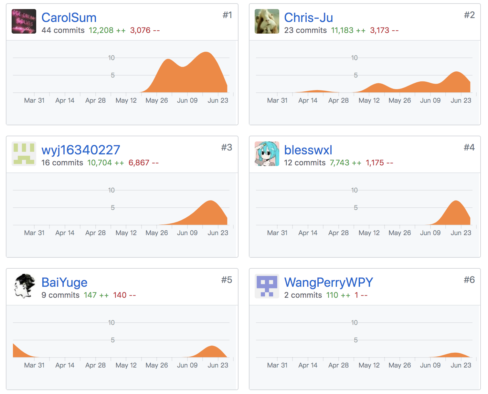
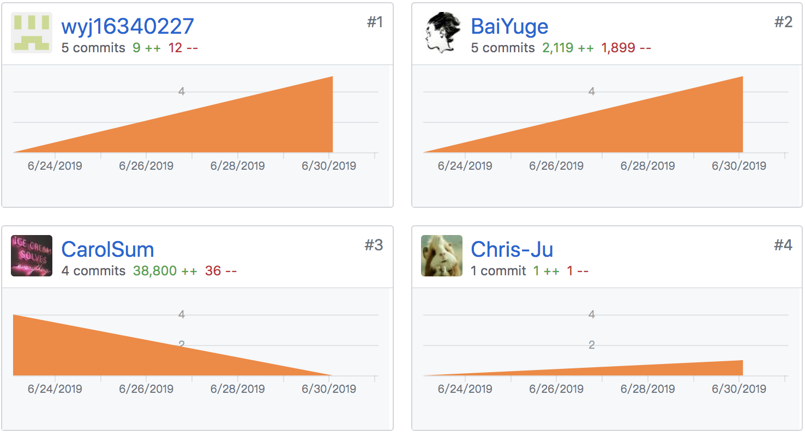

\---

title: Jingle 系统分析与设计

tag: 个人报告

\---

# 系统分析与设计课程个人报告

**16340003 BaiYuge**

## 1. 个人总结

### 1.1 学习收获

与之前的课程项目主要担任技术和部分设计工作不同，本次细分项目由其他五位同学担任技术工作，而所有的非技术工作由我一人担任，这意味着产品设计、项目管理还有用户体验设计的环节要交给我来主要把控，这对我来说既是乐趣，又是挑战。

这次的系统分析与设计项目真的让我受益良多，尤其是让我更加懂得了团队协作的重要性，为我将平时积累的产品和设计的方法论投入实践提供了宝贵的机会！

### 1.2 特别感谢

感谢我们组的全部组员，缺少了他们任何一个人，这次的系分项目都不可能成功完成。

也谢谢他们对我作为产品项目经理和设计师的工作支持。

16340118-CarolSum
16340227-wyj16340227
16340098-Chris-Ju
16340220-WangPerryWPY
16340241-blesswxl

## 2. PSP2.1 统计表

| PSP2.1            | Personal Software Process Stages | Time(%) |
| ----------------- | -------------------------------- | ------- |
| Planing           | 计划                             | 8       |
| * Estimate        | * 估计开发时间                   | 8       |
| Development       | 开发                             | 85      |
| * Analysis        | * 需求分析                       | 20      |
| * Design Spec     | * 生成设计文档                   | 25      |
| * Design Review   | * 设计复审                       | 5       |
| * Coding Standard | * 代码规范                       | 5       |
| * Design          | * 具体设计                       | 10      |
| * Coding          | * 具体编码                       | 5       |
| * Code Review     | * 代码复查                       | 5       |
| * Test            | * 测试                           | 10      |
| Reporting         | 报告                             | 7       |
| * Test Report     | * 测试报告                       | 3       |
| * Postmortem      | * 事后总结                       | 4       |

## 3. 个人Git统计报告

### 3.1 项目

### 3.2 文档

(注：因为第一次传文档时忘记配置邮箱，所以这里未计入当次的贡献率）

## 4. 工作清单

### 4.1 最得意

* 完整：第一次比较严格地按照产品设计的流程对本次课程项目做了一套完整产出：包括前期的市场研究、用户研究、需求分析、需求定义、信息架构设计、产品功能结构设计、交互设计、UI设计、可用性测试等，帮助我更好的将之前积累的理论知识迁移到实践上。
* 效果：最后得到的产品文档和原型比较细致，UI设计主要采用了material design，吸收了目前流行的ios 12的设计特色，无论是用户体验还是视觉效果都比之前的作品有了较大的进步；PRD也学习借鉴了了企业中PM的一些经典案例，较为全面实用；
* 纳新：之前的产品设计工作主要为web应用，这也是我第一次进行较大规模的的移动端的产品设计开发，学到了很多新的知识和技能。

### 4.2 最有价值

* “一图胜千言！”好的原型对开发的帮助是非常显著的。这次在确立了产品结构和需求以后，我先使用Axure制作低保真圆形，快速确立页面流程和功能需求，相比干巴巴的PRD也更利于开发的同学理解。
* 尝试了很多流行且实用的新的产品设计工具：之前的项目中我通常使用Axure完成低保真和高保真的制作，但是后来发现Axure制作高保真的效率并不高，也不利于开发人员实时查看和获取切图。这次我利用sketch制作高保真和视觉稿，我认为制作两套原型是非常必要的，因为会在制作高保真时带入更多对用户体验的思考，同时也是对原来的原型一次更细致的复查；
* 最后，使用蓝湖sketch插件将sketch文件实时更新上传到蓝湖上，这是我第一次使用这种类似于zeplin的设计开发协同软件，真的让设计开发效率大大提升，毕竟一个html胜过千万切图和压缩包啊！
* 学会敏捷开发，在一次次实践中学会如何不delay以及如何让队伍不delay；
* 协助各部分的技术人员完成团队的协调合作，理解技术限制和技术特点，制定更完善的开发计划；
* 一万小时定律，这次项目其实最难的在于把握整个产品的结构以及细节流程这件事，绞尽脑汁一直坚持着把这个事情完成，对自己的能力本身就有很大的提升！！

### 4.3 最有苦劳

最辛苦的时候大概就是有一段时间在图书馆连续几天每天只吃一顿饭疯狂做原型和写产品文档的时候了吧。其实使用设计软件和撰写一些产品文档并非难事，重要的是对于整个产品结构的把握的细节思考。这次的项目虽然功能并不复杂，但是为了让交互更顺畅，用户体验更好，要考虑非常多的细节，还有就是是关于“任务状态”这一部分划分的非常细致，很容易想重想漏，一开始可算是难到了我和服务端的同学。

好在最后看到一万多字的产品需求文档和两套还算精致的原型设计后还是很有满足感的，毕竟这里面也凝聚了自己很多个日夜的付出。其实一直觉得平时有很多计算机专业的同学对于IT项目非技术的职能并不重视，但是通过这次项目，我深刻体会到产品和设计的工作也是很需要思考和付出，结合先进的技术，才能做出真正优秀的产品。

无谓苦劳，大家都很辛苦哈哈哈哈哈。非常感激系分这门课程给我这次锻炼的机会！

## 5. 技术类、项目管理类博客

[互联网产品设计和用户体验小科普 ](https://github.com/systemanalyse/raiseMoney/blob/master/docs/%E6%8A%80%E6%9C%AF%E5%8D%9A%E5%AE%A2/TechReport16340003BaiYuge.md)

[Jingle 产品需求文档](https://github.com/systemanalyse/raiseMoney/blob/master/docs/Jingle%E8%BD%AF%E4%BB%B6%E9%9C%80%E6%B1%82%E8%AF%B4%E6%98%8E%E4%B9%A6.md)

[如何进行可用性测试](https://github.com/systemanalyse/raiseMoney/blob/master/docs/%E6%8A%80%E6%9C%AF%E5%8D%9A%E5%AE%A2/TechReport2_16340003BaiYuge.md)

