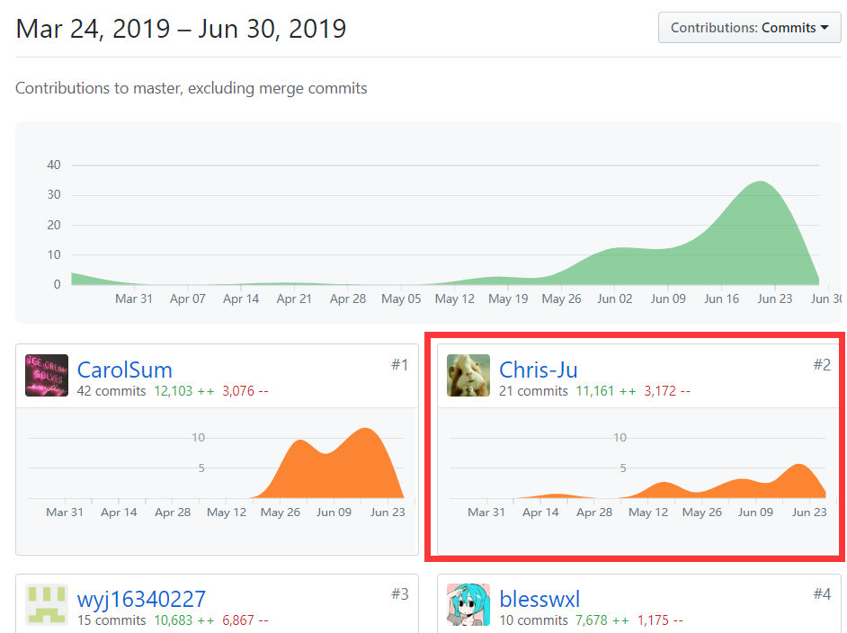

# 个人报告

## 工作总结

- 服务端代码编写
- 服务端部署
- 测试

在编写服务端过程中，应用了 MVC 设计模式，在产品需求还未定下时，我首先编写了 model 模块，其中包含对数据库的增删改查操作以及各个 model 的编写。由于 javascript 的异步特性，使用 callback 函数的话代码不美观，会造成回调地狱的问题。 ECMAScript 6.0 新标准 Promise 语法糖解决了这一问题，所以我将 database 操作封装，根据传入的表、列、值、条件等参数来对数据库进行同步操作。  

在产品需求提出后，我对应前端需求完成了 api 编写。  
对于每个 api 有着与之对应的 controller 来进行相应操作，并返回操作的结果，代码可读性较强，可维护性也比较高。在与前端交互过程中，由于代码维护性很高，所以可以很快的解决前端所提出的问题，很轻松地满足产品所提出的新需求，但不足的是，对于 model DD 与 model PP 未进行区分，皆当作 model task 来进行处理，导致一些代码较为复杂，降低了效率，这是在代码编写前没有预料到的。  

**在服务端编写过程中，考虑了许多网络安全的问题。**

- 对于类似越权等问题：
  - 对所有 api 验证使用了 session 可以避免非登录用户进行操作。
  - 对每个用户的权限进行了限制，如用户不可接自己的单，用户不可重复接单，用户无法查看他人私密信息等
- 对于 Web 基础漏洞等问题：
  - 对 sql 语句进行了严格转义，避免了 sql 注入漏洞
  - 对标签进行了处理，避免了 xss 漏洞
  - 对图片上传进行了过滤，避免了文件上传漏洞

在测试过程中，使用了软件测试课程中的白盒思想

## 个人分支的 GIT 统计报告

## 个人感受

在以前开发项目过程中，并没有过如同这一次从市场调研，到产品分析，到架构设计，再到代码实现的过程。所以在本次项目中，学习到了很多交互的经验以及更加理解了各种设计模式。不足之处就是对于有些模型的设计并没有考虑全面，关系型数据库的设计并不是符合范式，存在一些遗憾。
