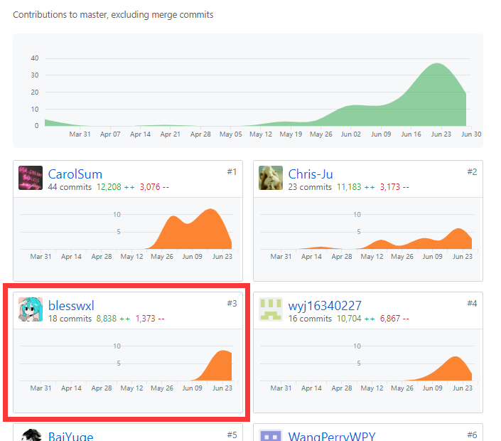

# 16340241-blesswxl Final Report

[TOC]

## 1 简短的课程学习自我总结（400字以内）

### 1.1 学习收获

[本次项目](https://github.com/systemanalyse/raiseMoney)中我们小组通力合作完成了 Jingle 安卓应用。虽然项目规模很小，但是作为系统分析与设计课程的实验项目，整个过程中小组按照策划、需求分析、设计、测试等流程有计划的实现下来，收获的不仅仅是我面对的技术上的经验，更重要的是宝贵的项目经验。在项目中我主要担任了前端的开发工作，主要包括发现页面，发布页面以及整个详情页面的实现。我的主要收获有：

* 在设计过程中与小组成员进行思路的交流，共同明确项目需求、技术栈等

* 学习到很多安卓开发基础知识，包括设计模式、网络服务，以及项目中使用到的其他各种技术等
* 项目中使用 Restful API 架构，在使用过程中既体会到了接口规范设计的重要性，也体会到了这种优秀的设计给前后端对接带来的便利
* 学习规范化使用 github 来协同开发

### 1.2 感谢

小组中的各成员各司其职，共同完成了本项目，在这里向他们表示诚挚的感谢。特别感谢前端 CarolSum 大佬的框架，为我的编码过程提供了极大的便利。

## 2 PSP 2.1 统计表

| PSP2.1                   | Personal Software Process Stages | Time (%) |
| ------------------------ | -------------------------------- | -------- |
| __Planing__              | __计划__                         | __10__   |
| Estimate                 | 估计这个任务需要多少时间         | 10       |
| __Development__          | __开发__                         | __82__   |
| Analysis                 | 需求分析                         | 15       |
| Design Spec              | 生成设计文档                     | 6        |
| Design Review            | 设计复审                         | 2        |
| Coding Standard          | 生成代码规范                     | 2        |
| Design                   | 具体设计                         | 10       |
| Coding                   | 具体编码                         | 25       |
| Code Review              | 代码复审                         | 2        |
| Test                     | 测试                             | 20       |
| __Reporting__            | __报告__                         | __8__    |
| Test Report              | 测试报告                         | 0        |
| Size Measurement         | 计算工作量                       | 3        |
| Process Improvement Plan | 事后总结及改进计划               | 5        |

## 3 个人分支的 GIT 统计报告

### 4 工作清单

发现页面以及详情页面、发布页面的实现。

其中任务详情页面最为复杂，可以说是是整个程序的核心页面，要处理用户信息、发布的任务等各种输入状态，最终呈现出一个友好的界面，将每一个任务清晰明确的展示给用户，并提供一定的交互。这部分的编码与测试工作花费了我较多的时间。

你可以点击下面的链接输入密码在线浏览 Jingle 的高保真 UI 设计：

[Jingle 高保真原型设计](https://lanhuapp.com/url/RFtA5) 密码：jh0P

## 5. 个人的技术类、项目管理类博客清单

[Android开发 Fragment的子Fragment+TabLayout+ViewPager 的使用](https://blog.csdn.net/wxlSAMA/article/details/94357598) 

[Android开发 TabLayout 选中改变字体大小颜色、指示线](https://blog.csdn.net/wxlSAMA/article/details/94358759) 

[Android开发 实现点击缩略图查看大图的功能](https://blog.csdn.net/wxlSAMA/article/details/94355377) 

[Android开发 图片加载库 Glide 的使用](https://blog.csdn.net/wxlSAMA/article/details/94352501) 