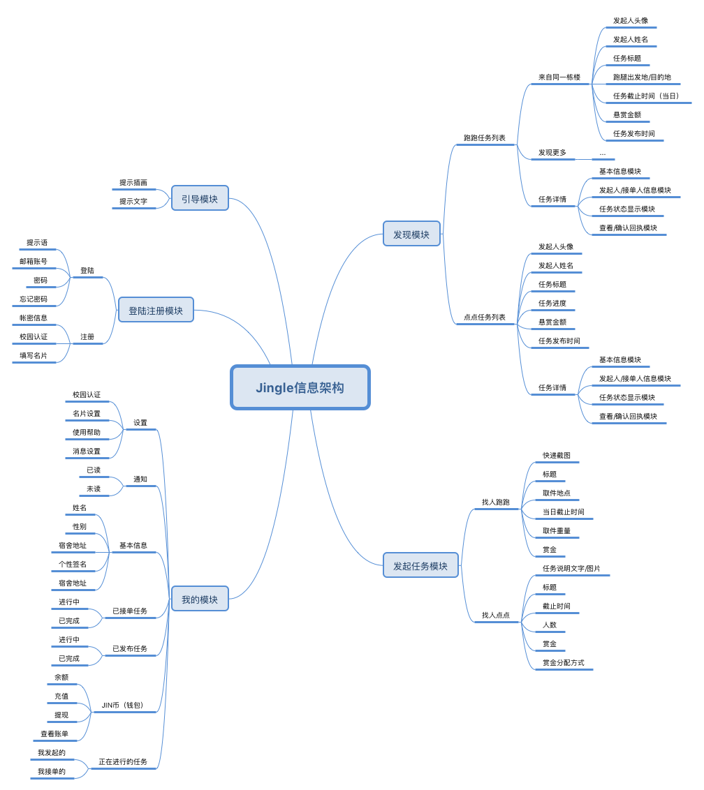
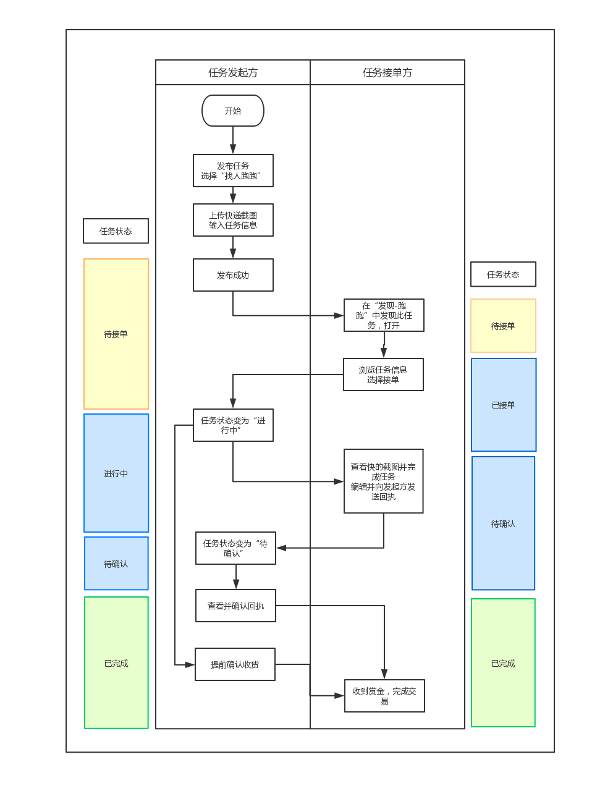
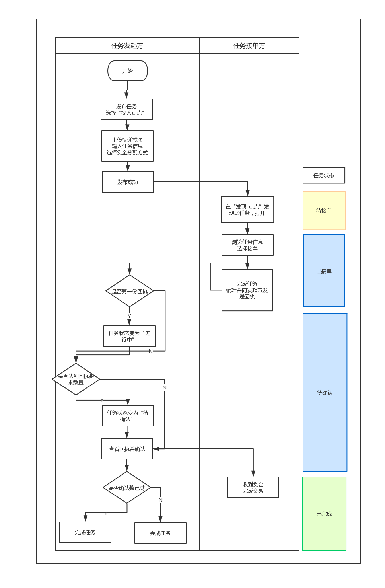
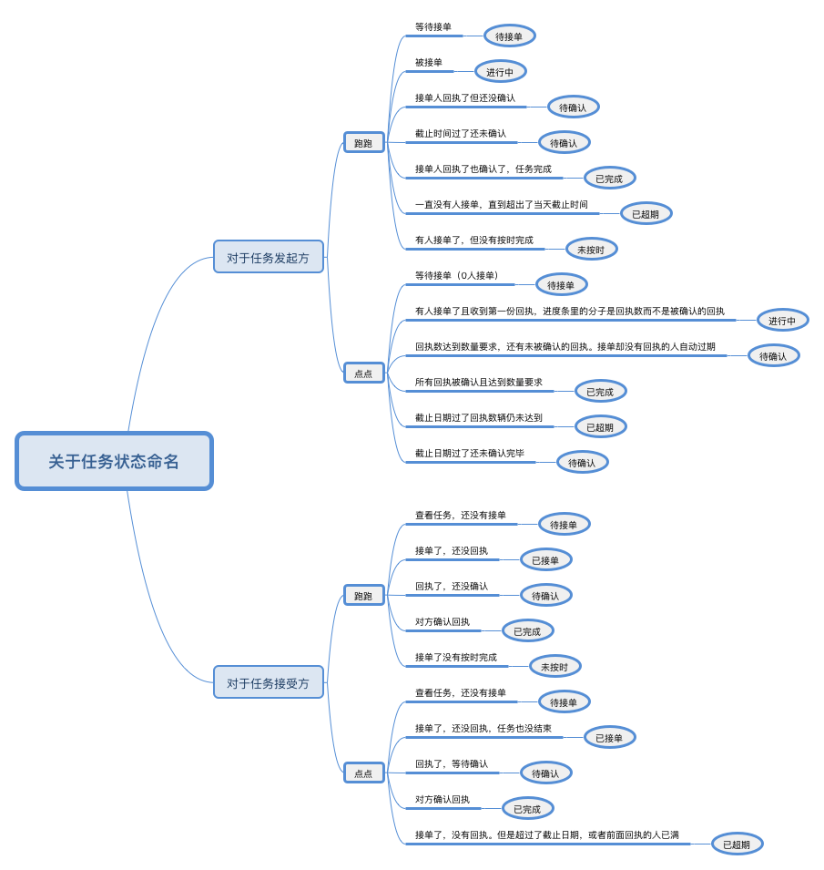

\---

title: Jingle 系统分析与设计

tag: 产品特性 Product Backlog

\---

# 5.产品特性

## 5.1 产品结构

### 5.1.1 信息架构图

### 5.1.2 功能结构图

## 5.2 总体业务流程图

### 5.2.1 跑跑任务（不考虑异常情况）

### 5.2.2 点点任务（不考虑异常情况）

## 5.3 全局说明

### 5.3.1 名词术语说明

| **名称** | **说明**                                                     |
| :------- | :----------------------------------------------------------- |
| 跑跑     | 本款产品支持的两种任务类型之一，发起者通过发起“跑跑”任务，一对一召集接单人在当天截止时间前帮助自己完成取快递或者其他跑腿，送至自己的宿舍并对其支付报酬。 |
| 点点     | 本款产品支持的两种任务类型中的另一种，发起者通过发起“点点”任务，一对一或者一对多召集接单人在截止时间前帮助自己完成可以在线完成的任务，如公众号评论点赞评论、调查问卷、线上投票等任务，并在其回执完毕之后对其支付报酬。 |
| JIN币    | 本款产品交易过程中使用的虚拟币，1 JIN币 = 0.1 RMB。用户可以通过充值JIN币在任务平台进行交易。也可以在做任务赚钱后将JIN币提现至银行卡。 |
| 回执     | 当接单人完成发起人布置的任务后，需要通过向发起人发送回执来作为自己已完成任务的凭证，发起人查看并确认回执后双方之间的交易才能真正完成。 |

### 5.3.2 功能权限说明

由于本款产品基于校园实名认证的安全信任机制，并且包含有金钱交易操作，故对用户的身份认证有的较为严格的要求。具体的功能权限对应如下：

- 是否初次打开App：展示引导页，引导用户初步了解产品和，吸引其使用。
- 是否完成校园认证：注册时，除了常规的帐密设置外，用户还应该通过第二步的校园认证，否则注册失败。而第三步的个人名片填写则可先跳过之后填写。完成前2或3步注册流程后，可直接登陆账号进入app。
- 是否已登陆： 未登陆无法查看和使用本款App；登陆后可以查看任务列表、正常使用“我的”模块的功能。
- 是否完善联系方式：在保证“我的-设置-我的名片”中的联系方式至少为两种及以上（即至少保证有手机号码和注册邮箱）才可以进行任务的接单。
- 钱包中余额是否充足：钱包中的JIN币数不少于发布任务的赏金总额时，才可以正常发布任务。

至此，用户可享受本款产品的全部服务。

### 5.3.3 数据显示规范

| **名称**                      | **格式**                                                     | **示例**                                                     |
| :---------------------------- | :----------------------------------------------------------- | :----------------------------------------------------------- |
| 任务发起、接单、完成时间  | **【当日】**  今天 HH(时) : MM(分)     **【其他】**  X(年） - Y (月）- Z(日）HH(时) : MM(分)  | 今天 17 : 40   今天 09 : 10     2019-06-30  17:40   2018-06-09 08:52  |
| 任务截止时间              | **【跑跑】**  今天 HH(时) : MM(分)     **【点点当日】**  今天 HH(时) : MM(分)     **【点点其他】**  X(年） - Y (月）- Z(日）HH(时) : MM(分)  | 同上                                                         |
| 任务截止剩余时间          | **【不足一天】**  (H)H 小时 (M)M 分钟     **【超过一天】**  D 天 (H)H 小时 (M)M 分钟  | 9 小时 32 分钟   12 小时 9 分钟   0 小时 12 分钟     12 天 9 小时 32 分钟   3 天 0 小时 0 分钟  |
| JIN币金额                 | 小数点后两位                                             | 0.12 JIN币   0.50 JIN币                              |

### 5.3.4 任务状态命名及权限

#### 1) 任务状态命名

#### 2) 各状态对应权限

| 任务类型 | 对象   | 状态（id) | 权限                                                         |
| -------- | ------ | --------- | ------------------------------------------------------------ |
| 跑跑     | 发起方 | 待接单 0  | 自己发布的任务只能在“我的”查看，不会出现在“发现_跑跑“中      |
|          |        | 进行中 1  | 对方已接单，此时可以查看对方的信息（名片），同时应该将此任务从“发现”中移除，不能被其他人接单。  如果在回执前确认完成，则双方都跳转至“已完成状态”  |
|          |        | 待确认 2  | 对方发送回执后，查看其回执如果已经超过截止日期还未确认，状态仍然显示为“待确认”  |
|          |        | 已完成 3  | 钱发送至对方账户，双方仍能查看互相的信息还有回执内容。不能进行其他操作。 双方发送通知。  |
|          |        | 已超期 4  | 超期后钱退回账户，发起方发送通知。此时任务从“发现”移除       |
|          |        | 未按时 5  | 对方未按时完成，钱退回账户。双方发送通知                     |
|          | 接受方 | 待接单 0  | 能查看基本信息，不能看到发起方名片和快递界图                 |
|          |        | 已接单 1  | 已接单，此时可以查看对方的信息（名片），同时应该将此任务从“发现”中移除，不能被其他人接单。 已接单的任务只能在“我的”查看。  |
|          |        | 待确认 2  | 发送回执后，可以查看到自己的回执                             |
|          |        | 已完成 3  | 钱发送至账户，双方仍能查看互相的信息还有回执内容。 不能进行其他操作如果对方提前确认，则不能查看自己的回执。 双方发送通知。  |
|          |        | 未按时 5  | 未按时完成。双方发送通知                                     |
| 点点     | 发起方 | 待接单 0  | 自己发布的任务只能在“我的”查看，不会出现在“发现_跑跑“中      |
|          |        | 进行中 1  | 这时已经有第一个人接单并发送回执。可以在回执清单李查看其回执和个人信息。 如果是奖金随机分配，则将第一个数分配给他，之后依次类推  |
|          |        | 待确认 2  | 当回执数已满，将该任务从“发现“中移除，同时已接单却没有回执的接单用户状态全部变为“已超期”。 如果已经超过截止日期还未确认，状态仍然显示为“待确认”  |
|          |        | 已完成 3  | 钱发送至对方账户，双方仍能查看互相的信息还有回执内容。不能进行其他操作。双方发送通知。  |
|          |        | 已超期 4  | 超期后剩余的钱退回账户，发送通知。“发现”中移除任务。如果之前有人回执，则可查看回执清单  |
|          | 接受方 | 待接单 0  | 能查看基本信息，不能看到发起方名片                           |
|          |        | 已接单 1  | 已接单，此时可以查看对方的信息（名片），同时应该将此任务从接受方的“发现”中移除。 已接单的任务只能在“我的”查看。  |
|          |        | 待确认 2  | 发送回执后，可以查看到自己的回执                             |
|          |        | 已完成 3  | 钱发送至账户，仍能查看对方的信息还有自己的回执内容。不能进行其他操作 |
|          |        | 已超期 4  | 状态变更                                                     |

### 5.3.1 全局交互说明

具体请查看 Jingle 交互设计文档

[Jingle 全局交互设计](https://github.com/systemanalyse/blog/blob/master/source/_posts/7.1.1Jingle%20%E5%85%A8%E5%B1%80%E4%BA%A4%E4%BA%92%E8%AE%BE%E8%AE%A1.md)

## 5.4 功能性需求说明

### 5.4.1 需求池&需求清单

#### 1) 管理需求池

- 需求来源：PM
- 需求类型：新增需求、需求调整、功能优化、BUG修复、UI优化
- 系统：涉及到的系统及模块
- 需求说明：简述需求
- 优先级判断：重要紧急P1、重要但不紧急P2、紧急但不重要P3、既不紧急也不重要P4

| 需求来源     | 需求类型 | 系统 | 需求说明 | 优先级判断 |
| :----------- | :------- | :--- | :------- | :--------- |
| PM（白彧歌） | ...      | ...  | ...      | ...        |

#### 2) 需求清单

对需求管理池评估筛选后，将需求模块、对应功能、需求优先级、完成情况统一整理到下表，可得：

| 模块      | 功能                | 功能简述                                                | 关联功能                                              | 优先级 | 完成情况 |
| --------- | ------------------- | ------------------------------------------------------- | ----------------------------------------------------- | ------ | -------- |
| 引导页    | 引导页              | 引导新用户和长时间未使用的用户                          | 登陆                                                  | P4     | 已完成   |
| 登陆/注册 | 登陆                | 用户使用本产品的前置条件                                | 全部                                                  | P1     | 已完成   |
|           | 注册-注册账号密码   | 用户登录凭证                                            | 登陆                                                  | P1     | 已完成   |
|           | 注册-校园认证       | 安全保证，使用本产品的必要条件                          | 全部                                                  | P2     | 已完成   |
|           | 注册-个人资料       | 用于其他用户了解、联系                                  | 发现、发起任务、我的模块                              | P2     | 已完成   |
|           | 找回密码            | 找回忘记的密码，修改密码，保证安全                      | 登陆                                                  | P4     | 已完成   |
| 发现      | 发现页              | 帮助接单者发现待接单的任务                              | 发现模块全部功能                                      | P1     | 已完成   |
|           | 跑跑任务相关        | 跑跑任务从发起后到完成关于任务双方的全部流程            | 发现模块全部功能、已发起/接单任务列表、通知、个人主页 | p1     | 已完成   |
|           | 点点任务相关        | 点点任务从发起后到完成关于任务双方的全部流程            | 发现模块全部功能、已发起/接单任务列表、通知、个人主页 | P1     | 已完成   |
|           | 点点-回执清单       | 接单方单独批量确认回执的入口                            | 点点任务相关                                          | P1     | 已完成   |
| 发起任务  | 找人跑跑            | 发起跑跑任务                                            | 发现模块全部功能，个人主页，通知，已发起任务列表      | P1     | 已完成   |
|           | 找人点点            | 发起点点任务                                            | 发现模块全部功能，个人主页，通知，已发起任务列表      | P1     | 已完成   |
| 我的      | 个人主页            | 用户处理个人任务、通知、钱包、资料认证以及App设置的入口 | 全部                                                  | P1     | 已完成   |
|           | 设置                | 校园认证、个人资料及其他设置                            | 全部                                                  | P2     | 已完成   |
|           | 通知                | 用户接受任务相关及提现通知                              | 发现模块、我的钱包-提现                               | P2     | 已完成   |
|           | 已发起/接单任务列表 | 用户查看已发起/接单任务入口                             | 发现模块，发起任务模块                                | P1     | 已完成   |
|           | 我的钱包            | 提供给用户，用于对其JIN币账户进行查看和管理             | 发现、发起任务、我的模块                              | P1     | 已完成   |
|           | 我的钱包-充值       | 对JIN币进行充值                                         | 发起任务、我的模块                                    | P1     | 已完成   |
|           | 我的钱包-提现       | 对JIN币进行提现                                         | 我的模块                                              | P3     | 已完成   |

### 5.4.2 产品各功能需求及页面交互

具体请查看 Jingle 交互设计文档

[Jingle 各页面交互设计](https://github.com/systemanalyse/blog/blob/master/source/_posts/7.1.2Jingle%20%E5%90%84%E9%A1%B5%E9%9D%A2%E4%BA%A4%E4%BA%92%E8%AE%BE%E8%AE%A1.md)

## 5.5 非功能性需求说明

### 5.5.1 性能需求

- app启动时间不超过5秒
- app内操作的响应时间不超过3秒，在网络连接超时/弱网情况下，需给出相应提示并可重新加载
- 程序闲时没有异常的CPU占用，忙时没有异常的峰值占用
- 前端实现图片懒加载，节约用户流量，保障页面加载速度
- 并发能力要较高，系统必须顺畅运行

### 5.5.2 可用性需求

- 兼容性：需要 Android 4.4 或更高版本
- 容错性：程序应该通过不唐突的无模态反馈提醒用户录入时的状态，帮助用户校验，保证数据条目输入的有效性
- 状态可见：让用户了解自己处于何种状态
- 环境贴切：使用用户熟悉的界面范式和概念
- 用户可控：页面出口应明显，防止用户因误触某些功能而无法返回
- 一致性：结构/色彩/文字/操作/反馈一致性
- 人性化帮助：在重要的功能入口处提供相应的帮助入口

