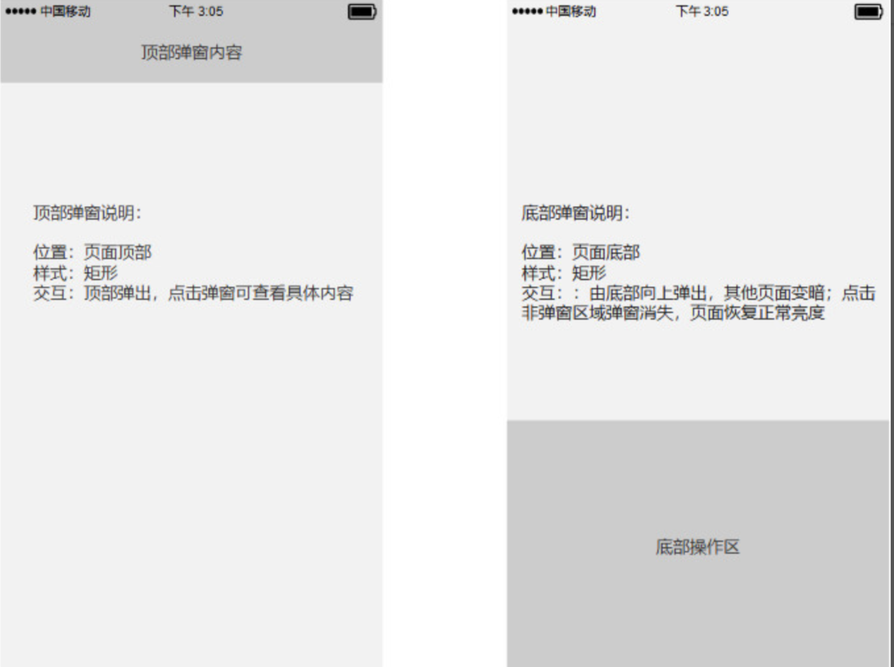
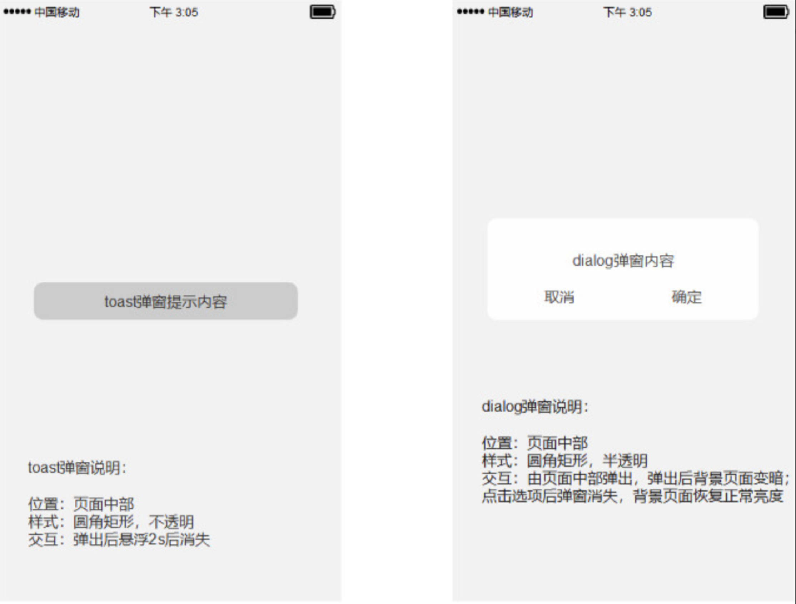
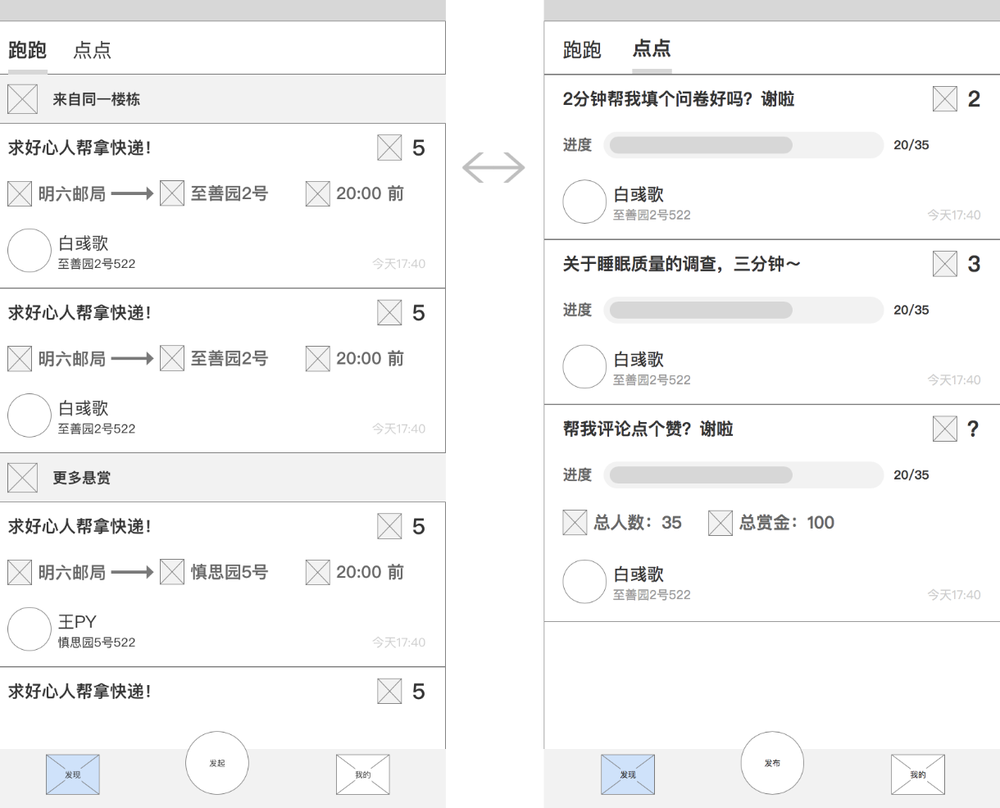

\---

title: Jingle 系统分析与设计

tag: 全局交互 Global interaction

\---

# 7.1.1 Jingle 全局交互设计

### 1） 键盘说明

需要输入任何信息时，键盘均由屏幕底部向上弹出。

### 2） 打断后重新打开App

- 锁屏后重新解锁：用户使用的页面。
- 切换到其它应用之后再切换回来：用户使用的页面。
- 后台关闭后：回到首页。
- 临时出现短信或来自其他应用的通知：不处理。

### 3）点击空白区域或无网络情况

| **操作**     | **响应**                                                     |
| :----------- | :----------------------------------------------------------- |
| 点击空白区域 | 如果当前界面有键盘，则将键盘向下滑动藏                       |
| 无网络时     | 部分页面弹出toast：“当前网络不可用，请检查网络设置”，时延：2s |

### 4）页面内交互

#### 弹窗加载：

#### 提示信息

### 5） 页面间交互

#### 发现页在屏幕上手指拖动左右滑动，可切换顶部标签栏中的“跑跑”和“点点”tab

### 6）页面异常

