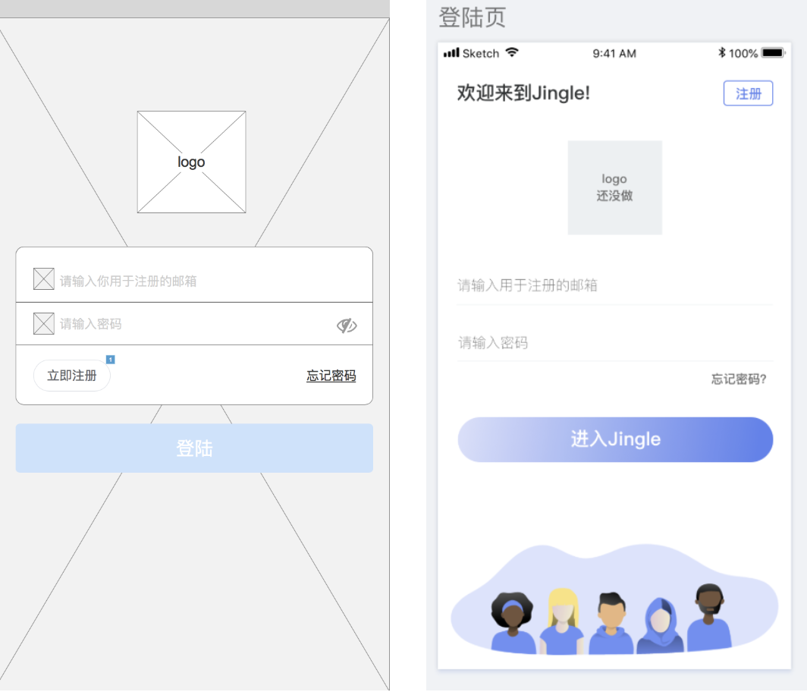
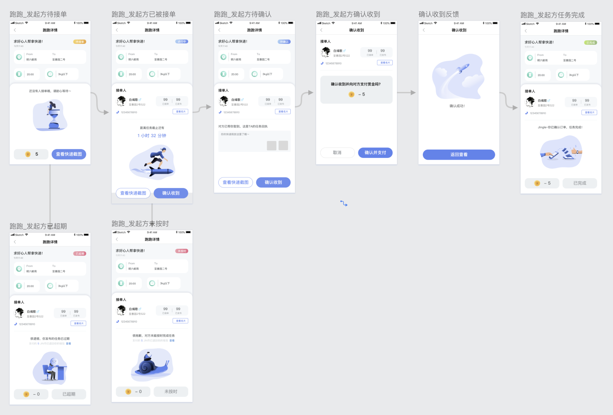
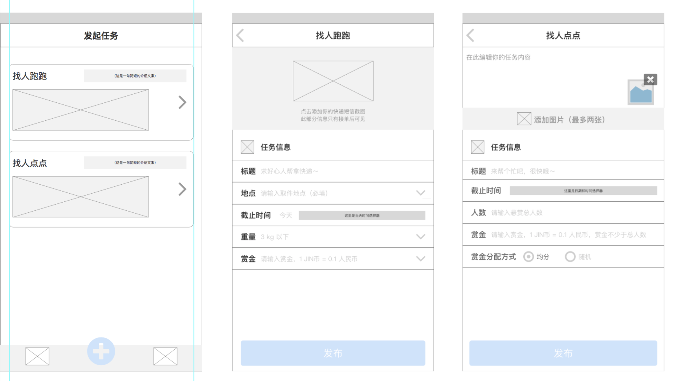
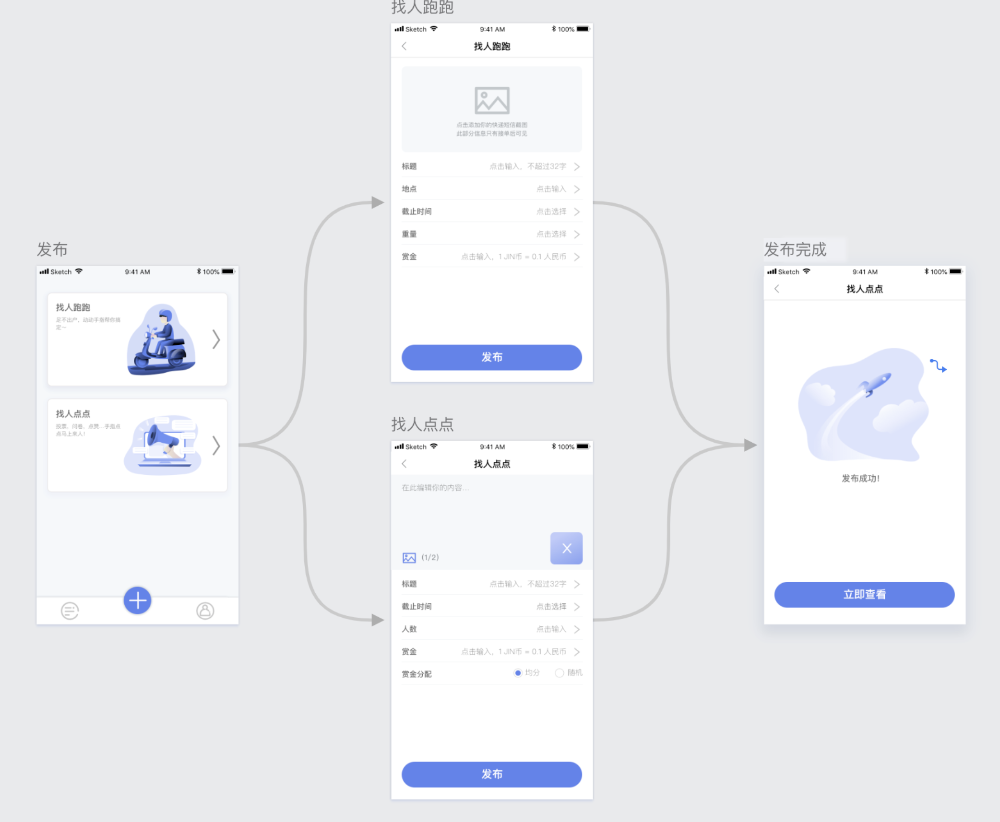
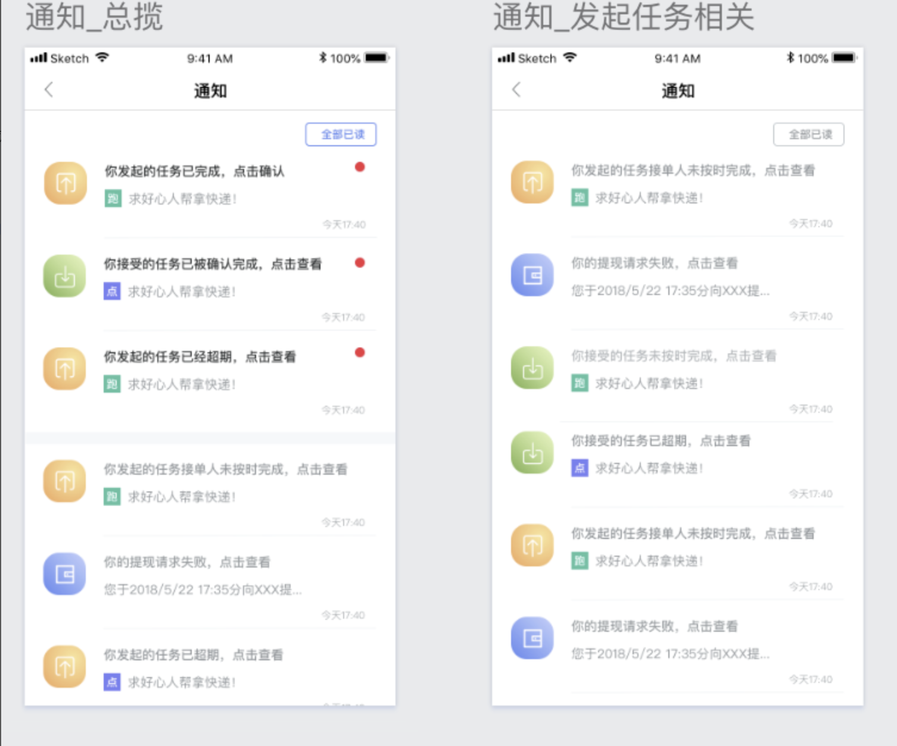

\---

title: Jingle 系统分析与设计

tag: 各页面交互 Page interaction

\---

# 7.1.1 Jingle 各页面交互设计

### 1） 引导/启动页

| 页面名称 | 引导/启动页                                                  |
| :------- | :----------------------------------------------------------- |
| 入口     | ---                                                          |
| 前置条件 | 第一次使用或长时间未使用产品                                 |
| 页面逻辑 | 用户在第一次使用产品或长时间未打开产品时，用于引导和提示用户产品功能，介绍产品特色，激发用户使用欲望 |
| 后置条件 | 进入登陆注册页                                               |
| 页面交互 | 用户点击“下一步”按钮（右箭头），切换至下一页，第三页继续点击进入登陆注册页面 |

### 2） 登陆/注册页

------

#### 登陆

（低/高保真原型图）

| 页面名称   | 登陆页                                                       |
| :--------- | :----------------------------------------------------------- |
| 入口       | --- / 引导页                                                 |
| 前置条件   | 用户长时间未使用产品或退出登录                               |
| 基本事件流 | 用户通过输入注册邮箱和密码登陆其账号使用本产品               |
| 后置条件   | 登陆成功/登陆失败重新登录                                    |
| 页面逻辑   | 1. 点击“立即注册”跳转至注册页面； 2. 点击“忘记密码”进入密码找回界面；  3. 点击“进入Jingle”，若成功登陆，则进入“发现-跑跑” |
| 页面交互   | 1. 用户输入注册邮箱和密码，点击“登陆”按钮，若成功直接跳转。失败则toast提示错误信息 |

#### 注册

（低/高保真原型图）

|  功能描述  | 注册                                                         |
| :--------: | :----------------------------------------------------------- |
| 基本事件流 | 1. 账号密码设置 2. 校园认证 3. 个人资料设置（可先跳过） 4. 完成注册，并在注册完成后直接登陆进入App |
|    入口    | 登陆页                                                       |
|  前置条件  | 第一次使用本产品                                             |
|  后置条件  | 注册成功/账号密码有错误，重新填写/校园认证失败，重新认证     |
|  页面逻辑  | 1. 点击“下一步”按钮进入下一页，点击“以后再说”、“完成”跳转提示注册完成 |
| 页面内交互 | 1. 创建账号时，要对输入邮箱、密码格式和邮箱是否已存在进行检查。 密码格式：6 - 12位，使用英文字母、数字、符号的组合； 2. 因为beta版测试主要针对中山大学学生，可在进入校园认证页面的学校栏，默认填入中山大学； 3. 填写名片的邮箱默认注册邮箱； 4. 前两步用户需全部填满信息，下方的“下一步”按钮才从不可点击的灰色变为蓝色可点击状态，填写名片页，只有用户填写手机号码以后，“完成”按钮才从不可点击的灰色变为蓝色可点击状态； 5. 更换头像点击头像打开手机相册上传头像。 |

## 2）发现页

### 2-1 跑跑

**跑跑任务接单方页面流程**

|  功能描述  | 跑跑任务接单方                                               |
| :--------: | :----------------------------------------------------------- |
| 基本事件流 | 1. 浏览任务列表   2. 查看任务详情   3. 接单任务   4. 查看快的截图，做任务   5. 任务完成，向任务发起方提供回执   6. 等待确认   7. 任务完成，赏金到账  |
|    入口    | 1.发现 2.我的 3. 我的-已接单任务列表                         |
|  前置条件  | 有等待接单的跑跑任务在发现列表中                             |
|  异常流程  | 任务未按时完成/任务超期 （参照4.10）                         |
|  页面逻辑  | 1. 在 发现- 跑跑中浏览待接单任务列表，点击其中一项进入该任务详情 2. 查看任务、赏金情况，点击接单按钮，页面状态变为“已接单”   3. 点击“查看快递截图”弹出截图图片，点击“查看名片”进入发起方名片页面，点击“通知已取”进入回执编辑页面   4. 点击发送，若发送成功跳转至反馈成功的页面；   5. 点击“返回任务详情”返回至任务详情页，页面状态变为“待确认”   6. 当发起方确认回执后，任务完成，页面状态改变为“已完成”  |
| 页面内交互 | 1. 接单后，页面状态变为“已接单”，显示任务倒计时。发起方信息下方新增“查看名片”按钮和发起方联系电话。 2. 编辑回执页面，点击编辑框左下角icon，可从相册中选择添加，并在该icon右侧显示当前添加图片数量，最多两张。添加的图片将把缩略图显示在编辑框右下角，点击缩略图上的“X"符号可以取消已添加的图片。 3.任务完成时，屏幕左下角会显示最终的交易情况。收到赏金显示“+”符号。  |
|  补充说明  | 用户接单时需判断用户是否已经填写手机号码，若未填写，则dialog提示用户先进入“我的-设置-我的名片”完善用户个人名片 |

**跑跑任务发起方页面流程**

|  功能描述  | 跑跑任务接单方                                               |
| :--------: | :----------------------------------------------------------- |
| 基本事件流 | 1. 等待接单   2. 查看接单方回执   3. 查看并确认回执   4. 任务完成  |
|    入口    | 1.我的  2. 我的-已发起任务列表                       |
|  前置条件  | 已发起跑跑任务，且该任务状态为“待接单”                       |
|  异常流程  | 任务未按时完成/任务超期 （参照4.10）                         |
|  页面逻辑  | 1. 点击“查看快递截图”弹出截图图片，点击“查看名片”进入接单方名片页面，点击“确认收到”跳转至确认支付的页面（发起方可忽略是否已经收到回执，适用于当面交接的使用场景）； 2. 点击“确认并支付”直接确认任务完成，跳转至确认支付页面。 3. 点击“确认并支付”确认任务完成，跳转至反馈成功的页面； 4. 点击“返回查看”返回至任务详情页，页面状态变为“已完成”。  |
| 页面内交互 | 1. 对方接单后，页面状态变为“进行中”，显示任务倒计时。接单方信息下方新增“查看名片”按钮和接单方联系电话。 2. 任务完成时，屏幕左下角会显示最终的交易情况。支付赏金显示“-”符号。  |

### 2-2 点点

**点点任务接单方页面流程**

|  功能描述  |                        点点任务接单方                        |
| :--------: | :----------------------------------------------------------: |
| 基本事件流 | 1. 浏览任务列表2. 查看任务详情3. 接单任务4. 做任务，保存回执图片5. 任务完成，向任务发起方提供回执6. 等待确认7. 任务完成，赏金到账 |
|    入口    |             1.发现 2.我的 3. 我的-已接单任务列表             |
|  前置条件  |               有等待接单的点点任务在发现列表中               |
|  异常流程  |             任务未按时完成/任务超期 （参照4.10）             |
|  页面逻辑  | 1. 在 发现- 点点 中浏览待接单任务列表，点击其中一项进入该任务详情2. 查看任务、赏金情况，点击接单按钮，页面状态变为“已接单”3. 点击“查看名片”进入发起方名片页面，点击“通知对方已完成”进入回执编辑页面4. 点击发送，若发送成功跳转至反馈成功的页面；5. 点击“返回任务详情”返回至任务详情页，页面状态变为“待确认”6. 当发起方确认回执后，任务完成，页面状态改变为“已完成” |
| 页面内交互 | 1. 接单后，页面状态变为“已接单”，显示任务倒计时。发起方信息下方新增“查看名片”按钮和发起方联系电话。2. 编辑回执页面，点击编辑框左下角icon，可从相册中选择添加，并在该icon右侧显示当前添加图片数量，最多两张。添加的图片将把缩略图显示在编辑框右下角，点击缩略图上的“X"符号可以取消已添加的图片。3.任务完成时，屏幕左下角会显示最终的交易情况。收到赏金显示“+”符号。 |
|  补充说明  | 用户接单时需判断用户是否已经填写手机号码，若未填写，则dialog提示用户先进入“我的-设置-我的名片”完善用户个人名片 |

**点点任务发起方页面流程**

|  功能描述  | 点点任务发起方                                               |
| :--------: | :----------------------------------------------------------- |
| 基本事件流 | 1. 等待接单 2. 查看接单方回执 3. 批量 / 单独确认回执 4. 任务完成  |
|    入口    | 1.我的  2. 我的-已发起任务列表                       |
|  前置条件  | 已发起跑跑任务，且该任务状态为“待接单”                       |
|  异常流程  | 任务超期 （参照4.10）                                        |
|  页面逻辑  | 1. 点击“查看回执清单”进入回执清单列表，点击“查看名片”进入接单方名片页面；  **【单独确认回执】**   2. 在回执清单列表中，点击其中一项跳转至某一接单方回执详情，可查看该接单人回执内容和个人信息，点击“查看名片”进入接单方名片页面； 3. 在个人回执详情页中，点击“确认回执”直接确认该单个任务完成跳转至确认支付页面。  3. 点击“确认并支付”确认任务完成，跳转至反馈成功的页面； 4. 点击“返回查看”返回至该个人回执详情页，页面左下角显示赏金支付金额，右下角显示“已完成”状态；    **【批量确认回执】**   5. 在回执清单列表中，点击”选择全部按钮”，可批量选择多个未确认的接单方回执，选择完毕后点击“完成”，跳转至   6. 在个人回执详情页中，点击“确认回执”直接确认该单个任务完成跳转至确认支付页面。   7. 点击“确认并支付”确认任务完成，跳转至反馈成功的页面；   8. 点击“返回查看”返回至回执清单。点击已确认列表下的某项可跳转至该个人回执详情页。  |
| 页面内交互 | 1. 批量选择确认回执时，完成按钮会显示当前选择的人数   2. 批量选择的确认支付页面上方显示已选接单人的列表，点击“查看名片”可查看该接单人名片   3. 确认支付页面显示支付给接单人的赏金总额；   4. 回执详情页中，若该接单人已被确认，则页面左下角显示赏金支付金额，右下角显示“已完成”状态； 5.当待确认列表为空时，“选择确认回执”按钮变为灰色不可点击状态。  |

**回执清单空状态**

## 3）发起任务

（低/高保真原型图）

### 3-1 发起页

| 页面名称 | 任务发起页                                                   |
| :------: | :----------------------------------------------------------- |
| 功能描述 | 1. 用户可选择“找人跑跑”来发布跑跑任务; 2. 用户可选择“找人点点”来发布点点任务。  |
|   入口   | ---                                                          |
| 前置条件 | 户需要发布任务；                                             |
| 后置条件 | 登陆失败/登陆成功重新登录                                    |
| 页面逻辑 | 1. 点击“找人跑跑”跳转至跑跑发起页；   2. 点击“找人点点”跳转至点点发起页；  |
| 补充说明 | 1.用户发起任务时需判断用户是否已经填写手机号码，若未填写，则dialog提示用户先进入“我的-设置-我的名片”完善用户个人名片 2. 用户发起任务时需判断用户钱包余额是否为零，若为零，则dialog提示用户先进入“我的-钱包-充值”进行JIN币充值。  |

### 3-2 找人跑跑

| 页面名称   | 跑跑发起页                                                   |
| :--------- | ------------------------------------------------------------ |
| 功能描述   | 用户通过编辑任务内容和填写选择任务信息来来悬赏发布任务       |
| 基本事件流 | 1. 编辑任务内容；   2. 输入任务标题；   3. 输入地点；   4. 选择截止时间；   5. 选择快递重量范围（“3kg以下”、“3 - 5kg”、“5-10kg”、“10kg以上”）   6. 输入赏金； 7.确认完毕后发布任务。  |
| 入口       | 任务发起页                                                   |
| 前置条件   | 1. 需要发起跑跑任务 2. 已填写电话   3. 钱包非空  |
| 后置条件   | 发起成功/发起失败重新登录                                    |
| 页面逻辑   | 1. 点击“发布”按钮，跳转至反馈成功的页面； 2. 点击“立即查看”按钮，跳转任务详情页，从任务详情页返回时跳转至“我的”。  |
| 页面交互   | 1.输入截止时间时，屏幕中央出现时间选择器，由于跑跑任务只限于当天完成，则只需提供小时、分钟的选择；   2.选择快递重量范围时，在输入框下方弹出选项列表。  |

### 3-3 找人点点

| 页面名称   | 点点发起页                                                   |
| :--------- | :----------------------------------------------------------- |
| 功能描述   | 用户通过上传快递截图和填写选择任务信息来来悬赏发布任务       |
| 基本事件流 | 1. 上传快的截图； 2. 输入任务标题； 3. 选择截止时间； 4. 输入目标人数； 5. 输入赏金； 6. 选择赏金分配方式（“均分”、“随机”）   7.确认完毕后发布任务。  |
| 入口       | 任务发起页                                                   |
| 前置条件   | 1. 需要发起点点任务  2. 已填写电话  3. 钱包非空              |
| 后置条件   | 发起成功/发起失败重新登录                                    |
| 页面逻辑   | 1. 点击“发布”按钮，跳转至反馈成功的页面； 2. 点击“立即查看”按钮，跳转任务详情页，从任务详情页返回时跳转至“我的”。  |
| 页面交互   | 1.输入截止时间时，屏幕中央出现时间选择器，由于点点任务不限于当天完成，则需提供年、月、日、小时、分钟的选择；  |

## 4）我的

#### 4-1 个人主页

| 页面名称 | 我的                                                         |
| :------: | :----------------------------------------------------------- |
| 功能描述 | 用户处理个人任务、通知、钱包、资料认证以及App设置的入口      |
|   入口   | ---                                                          |
| 页面逻辑 | 1. 点击“设置”icon，跳转至设置页； 2. 点击“通知”icon，跳转至通知页; 3. 点击金刚区内“已接单”，跳转至“已接单任务列表”；   4. 点击金刚区内“已发起”，跳转至“已发起任务列表”；   5. 点击金刚区内“JIN币”，跳转至“我的钱包”；  6. 点击正在进行中的任务列表中某一项，跳转至该任务详情页。  |
| 页面交互 | 1.在“正在进行中的任务”区域内，若同时有发起和接单的任务，则可点击“正在发起的任务”标题下方的tab进行切换。 2. “正在发起的任务”标题旁显示当前正在进行的任务数量；   3. 切换tab右侧显示当前“我发起/接单的”任务数量；   4. 当有未读的通知时，“通知”icon的右上角显示红点，当通知全部已读时，红点消失。  |

#### 4-2 通知页

|  页面名称  | 通知页                                                       |
| :--------: | :----------------------------------------------------------- |
|  功能描述  | 用户查看通知的入口                                           |
| 基本事件流 | 1. 进入通知列表；  2. 查看通知详情 / 进入相应任务页面        |
|    入口    | 我的                                                         |
|  页面逻辑  | 1. 通知共分为三种类型： “发起任务相关”、“接单任务相关”、“提现相关”，用三种不同颜色icon表示，位于每条通知左边便于用户区分； 2. 当通知类型为“发起任务相关”、“接单任务相关”时，用户点击某一条通知进入该任务详情页。   3. 当通知类型为“提现相关”时，用户点击某一条通知进入该通知详情页。  |
|  页面交互  | 1. 当用户点击某一条通知后，该通知移入下方已读区域，标题变为灰色，红点消失（变为已读状态）； 2.当用户点击“全部已读”按钮，全部未读通知变为已读状态；   3. 当通知列表无未读通知时，“全部已读”按钮变为灰色不可点击状态。  |

#### 4-3 设置页

|  页面名称  | 设置页                                                       |
| :--------: | :----------------------------------------------------------- |
|  功能描述  | 用户进行设置及资料认证的入口                                 |
| 基本事件流 | 1. 进入设置页； 2. 校园认证 / 编辑我的名片/ 查看使用帮助 / 消息设置  |
|    入口    | 我的                                                         |
|  页面逻辑  | 1. 点击“校园认证” 跳转至 校园认证页，可查看之前的认证情况； 2. 点击“我的名片”跳转至 我的名片页，可查看之前填写的个人资料；   3 . 校园认证 与 我的名片 信息编辑流程与注册时相同；   4. 点击“使用帮助”跳转查看 用户帮助页面；   5. 点击“消息设置”跳转至消息设置页。  |
|  页面交互  | 1. 当用户刚点击进入 校园认证页 和 我的名片页 ，下方按钮颜色为灰色，不可点击，当点击输入框进行编辑或修改头像并检测到内容更改后，下方按钮变为蓝色可点击状态，点击后修改； 2.当编辑更改内容后直接点击左上方返回icon，则放弃对信息进行修改。  |

#### 4-4  已发起/接受任务列表页

|  页面名称  | 已发起/接受任务列表页                                        |
| :--------: | :----------------------------------------------------------- |
|  功能描述  | 用户查看进行中和历史任务，浏览任务状态和收支情况的入口       |
| 基本事件流 | 1. 进入已发起/接受任务列表页； 2. 查看已发起/接受任务详情。  |
|    入口    | 我的                                                         |
|  页面逻辑  | 1. 用户点击列表中某一项可进入该任务详情页； 2. 用户可以在列表中浏览每项任务任务收支情况（接单的点点任务如果正在进行中且赏金随机分配，则显示“+ ？”） 3 . 用户可以在列表中浏览每项历史任务的最终状态和进行中任务的当前状态； 4. 用户可以在列表中浏览每项任务中个人的发起/接单时间。  |

#### 4-5 我的钱包

（低/高保真原型图）

| 页面名称   | 我的钱包页                                                   |
| :--------- | :----------------------------------------------------------- |
| 功能描述   | 提供给用户，用于对其JIN币账户进行查看和管理                  |
| 基本事件流 | 1. 进入钱包可查看J账户IN币余额； 2. 点击“查看账单”，用户可查看自己的充值提现记录以及每项任务的收支情况；    **【JIN币充值】**   3. 进入充值页；   4. 选择需要充值的选项；   5. 确认支付；   6. 支付成功；      **【JIN币提现】**   7. 进入提现页；   8. 选择或绑定提现银行卡；   9. 输入提现金额或直接选择全部提现；   10. 点击确认提现；   11. 收到提现成功通知，提现完成。  |
| 入口       | 我的                                                         |
| 后置条件   | 充值成功/充值失败/提现成功/提现失败                          |
| 页面逻辑   | 1. 点击“查看账单”，跳转至账单页；    **【JIN币充值】**   2. 点击“充值”，跳转进入充值页；   3. 点击“确认支付”按钮，调出支付软件界面；   4. 若支付成功，跳转至成功反馈页面；   5. 若支付失败，跳转至失败反馈页面；   6. 点击“返回查看”按钮，跳转至 我的钱包页；    **  【JIN币提现】**   7. 点击“提现”，跳转进入提现页；   8. 若输入框非空且内容格式正确，点击“确认提现”按钮，跳转至成功发送提现请求的反馈页面   9. 点击“返回查看”按钮，跳转至 我的钱包页。  |
| 页面交互   | 1. 在“充值”页，当用户选中不同金额选项，左下方支付金额应该有相应变化； 2. 提现时，若用户之前未绑定银行卡，应在原显示银行卡位置提示用户先绑定银行卡；   3. 用户可以点击卡片右上方箭头打开银行卡列表选择已绑定的银行卡和添加新银行卡；   4. 应保证用户在提现金额输入框只能输入数字，并保证格式正确（小数点后最多两位）；  5.当用户点击 “全部提现”，对应的金额要自动添加在输入框；   6.用户点击确认提现时，应判断输入的金额是否小于等于全部余额；  |

