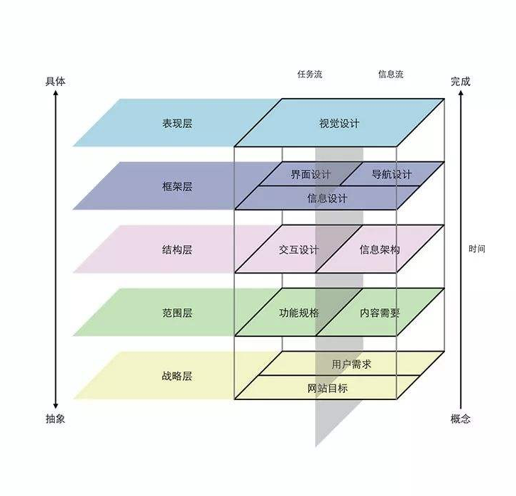
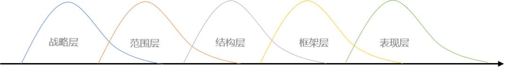
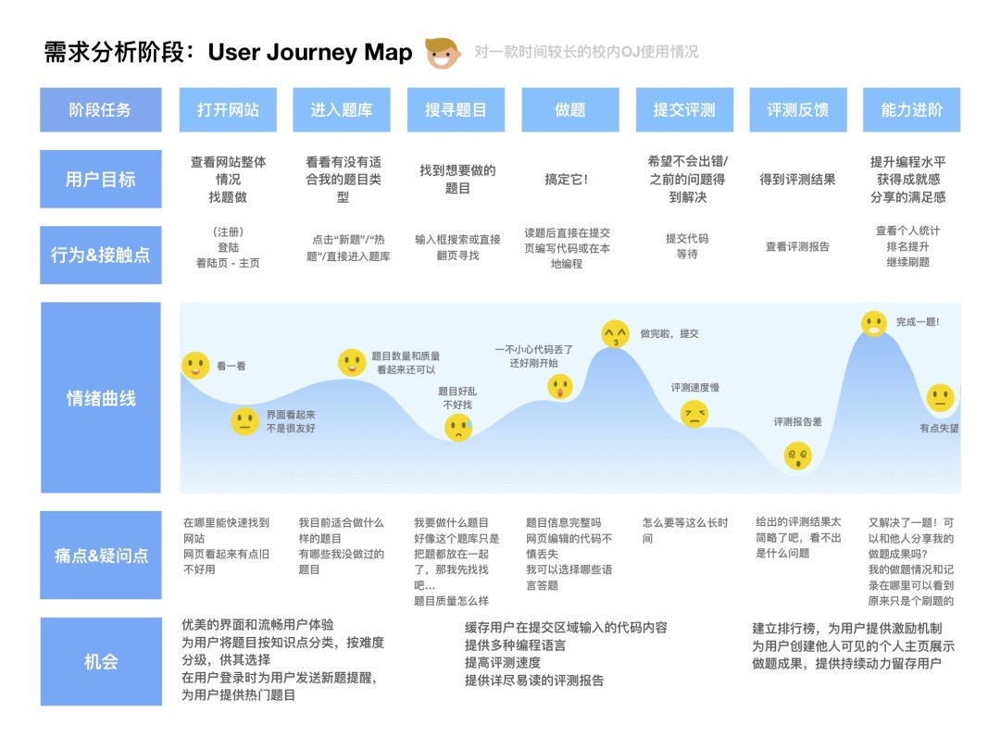
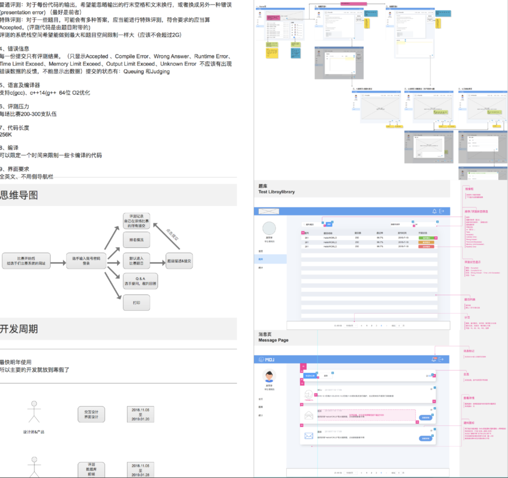
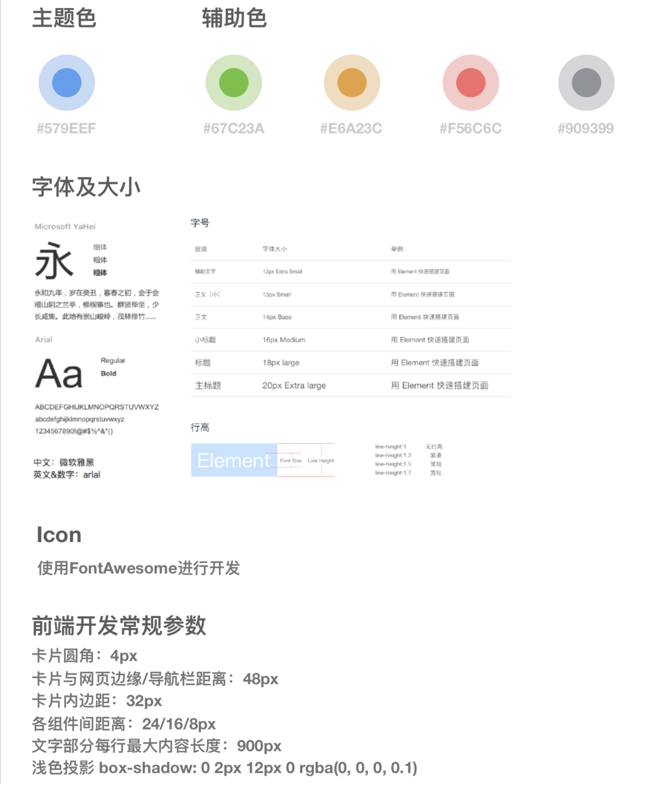
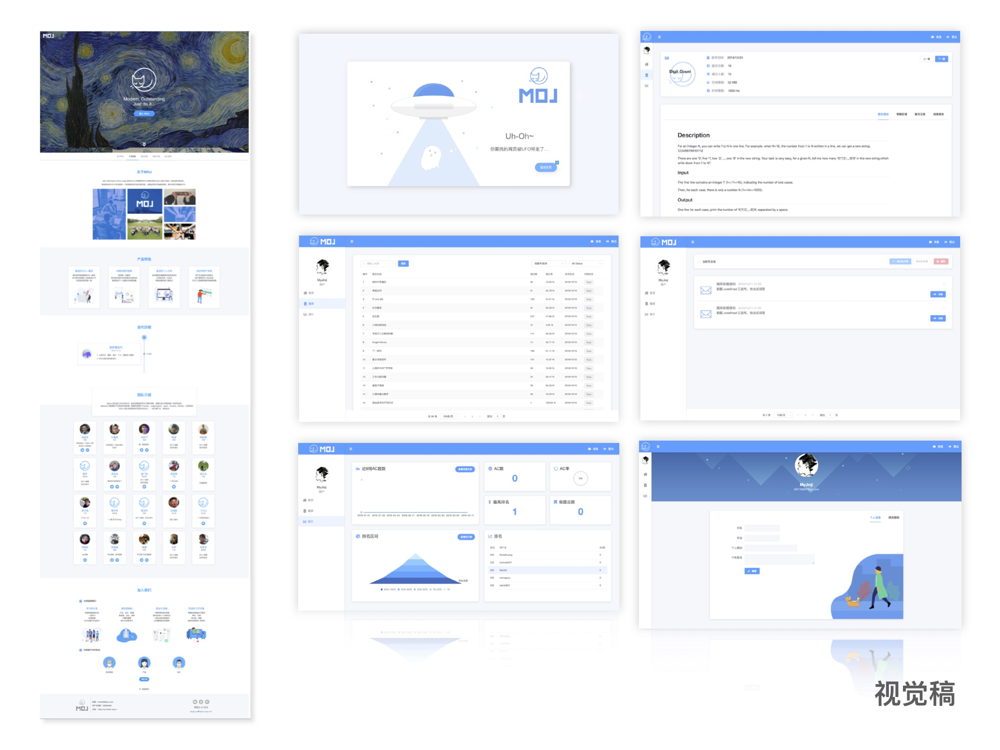

\---

title: Jingle 系统分析与设计

tag: 个人技术报告-互联网产品设计和用户体验小科普

\---

# 互联网产品设计和用户体验小科普

**16340003 BaiYuge**

## 0. 引言

一不小心“误入”计院已经第三年了，也已经接触到一些自己或是别人的课程和团队项目。

每次当一个项目仅有两三天就要进入开发阶段，终于谈到“界面”的时候，在项目小组讨论中就经常能听到如下对话：

> “xxx画画挺好的，找他来当个美工吧”
>
> “叫xxx来给咱搞个界面设计”
>
> “我记得xxx会PS，刚好来当美工吧”
>
> ...

狂热于“技术流”的同学挂在嘴边的“美工”，基本上指的就是软件产品开发中的设计师这一角色了。但是在实际企业级软件开发过程中，设计师的角色真的仅仅局限于画图抠图拖动控件吗？（当然不！）

在这篇分享文章中，我会介绍一些互联网产品设计常见概念，总结我了解到的用户体验要素知识，最后会给大家提供一些设计/用户体验的参考书目和网站，方便感兴趣的同学学习。

 

## 1. 相关概念介绍

以下是互联网类产品开发中几个常见的设计相关概念，供大家了解和区分：

### 1.1 IxD：Intereaction Design 交互设计

国际互动设计协会（IxDA）给其如下定义：

“交互设计（IxD）定义了交互系统的结构和行为。随着时代的发展，从计算机到移动设备，再到电器以及其他种种，交互设计师努力地在人、产品以及他们使用的服务之间创造有意义的关系。”

在交互设计里的交互层，本质是信息的交流与互动，包含用户、目标、场景，主角是信息交流互动的双方或多方。

交互设计里的设计层，就是在交互层的前提下，为一个事件合理的规划/计划（行为），并传达（媒介）出各种感觉（用户体验）。其本质在于为用户找到正确解决问题的媒介和手段。

交互设计可以理解为是用户与产品或某个功能交互的一个过程，比如包括交互前的引导，交互中的提示，交互后的反馈。更重要的是框架层级的划分。交互设计更偏重于执行层面。

### 1.2 UI：User Interface 用户界面

用户界面是一个较为广泛的概念，指人和机器互动过程中的界面。现在一般把屏幕上显示的图形用户界面（GUI ：Graphic User Interface）都简称为UI，较常见的有Web UI和移动端UI。

UI设计的任务是让用户认识产品的相貌和气质。设计时需要注意视觉层次的强弱、信息划分架构、用户浏览轨迹、色彩、质感使用的和理性和舒适度、以及视觉耐久度。让用户对于产品产生视觉上的“爽感”，留下对于产品最直观的好印象，从而“没事就想看一看用一用”。优秀的UI设计师还会注重品牌设计、运营设计和交互层面的问题等，与产品经理和交互设计师一起参与产品决策。

### 1.3 UE/UX:User Experience 用户体验

维基百科对用户体验设计的解释如下：用户体验设计是指通过提高产品的可用性、易用性、以及人与产品交互过程中的愉悦程度，从而来提高用户满意度的过程。用户体验设计包括传统的人机交互（HCI），并且延伸到解决所有与用户感受相关的问题。

用户体验关注用户在使用产品过程中的个人主观感受，关注用户使用前、使用过程中、使用后的整体感受，包括行为、情感、成就等各个方面。用户体验不仅仅来自于用户界面，UI只是其中一部分。

通俗的讲这是个整体的使用感受，包括受品牌影响，用户个人使用经验的影响，总之就是让用户产生使用过程中的“爽感”。

 

### 1.4 UCD:User Centered Design 以用户为中心的设计

UCD是一种设计模式和设计思维。强调在产品设计过程中，从用户角度出发来进行设计，用户优先。

产品设计有个BTU三圈图（Business, Technique, User），即一个好的产品，应该兼顾商业盈利，技术实现和用户需求。

无论是B、T还是U为优先进入产品设计，都可以设计出好的产品。UCD只是强调用户优先。在设计ToC类产品时尤其需要注意这一设计理念。

 

## 2.如何理解它们的关系？

用户体验拥有非常广阔范围，用户体验里包含了交互体验、视觉体验、流畅度体验、用户感知等，甚至后期产品的运营推广等多方面内容。可以说用户体验只是一个理念。交互设计和用户体验的关系其实就是用户体验包涵的交互的体验，而反过来说交互设计的过程中要运用用户体验的理念。

至于交互设计与视觉设计的区别，Google设计师Drew Shimomura 有一个简单的区分方式——

视觉设计追求“清晰与简洁”，而交互设计说：“别让我思考”。

## 3.了解用户体验五要素

现在，越来越多的互联网企业开始将“交互设计”这一岗位定位成“用户体验设计”，这也对设计师们提出了更高的要求。

优秀的用户体验对于企业和它的产品至关重要，尤其是对于以设计驱动产品的成熟互联网公司。因此，无论你对于产品经理，交互设计还是UI视觉感兴趣，甚至想要从事技术开发工作，你都应该了解用户体验。

 

用户体验的五要素这一概念是Jesse James Garrett在《用户体验要素-以用户为中心的产品设计》中提出的。他将用户体验由上到下分成了五个层次：

**表现层、框架层、结构层、范围层、战略层**

用户在使用产品时以从上到下的顺序体验产品，而产品经理和设计师则以相反的顺序来定义产品。

### 3.1 用户体验顺序

**表现层**

用户拿到产品后，产品呈现给用户的第一印象。例如，产品的主色调是什么、logo是什么样子，采用了列表设计还是卡片设计等。

**框架层**

当用户进入产品时，用户对产品的整体印象。例如，进入产品后，用户可以看到导航是怎么设计的，每个导航项对应的功能。怎么找到需要的内容，是通过列表还是搜索框。

**结构层**

用户开始使用产品后，用户对产品整体结构的感知（类似于你走进陌生商场对于各楼层商品种类的大致印象）。例如，从找题到完成评测的流程是如何的，在各个环节是否有信息提示等。

**范围层**

更深入地使用某个功能时，用户对功能的感知。例如，题库中的题目是否支持多语言评测，是否支持分类，支持何种分类方式，要提供什么样的评测报告。

**战略层**

用户使用完产品之后判断是否完成了他的目标。例如，通过产品刷题需要的内容、通过产品获得成就感等。

### 3.2 产品设计顺序

产品的设计和用户体验的顺序恰好是相反的。产品设计是自下而上的一个过程。是一个从抽象到具体的过程。

先对产品在战略上有一个定义。然后再根据战略目标，逐步的具体到产品的功能点、最后到具体的实现细节和设计风格上。

 

五个层次是自下而上的建设，但是各个层次之间并非完全独立，而是层层交叠递进。这样以便于实时对上一层设计中存在问题进行调整，将产品设计逐步具体细化。

**以下，我将以我之前在Matrix团队开发的在线评测系统 MOJ 担任 UE 设计师的过程为例，带大家走一遍“用户体验五要素”设计的流程。因为时间已经比较久远，作品也比较稚嫩，展示的作品成果仅供参考。**

#### 3.2.1 战略层 

**主要输出成果：MRD（市场需求文档），BRD（商业需求文档）**

 

战略层要解决“**我们为什么开发产品？**”的问题。设计师和市场销售人员需要辅助产品经理对产品进行产品机会评估。其关键在于弄清楚我们的用户是谁，用户的需求是什么？公司的商业价值和风险是什么？

Jesse James Garrett主要提了“**产品目标**”和“**用户需求**”两个参考维度,除此之外在这一层还应关注以下内容： 

**商业价值** 、**用户痛点（特征、期待、目标等）、市场现状和预期** 、**项目的风险、项目计划** 

此外，随着互联网市场“人口红利”逐渐流失，竞品相似度也越来越高，用户体验的作用也越来越重要。产品经理和设计师可以在战略阶段加入用户体验的思考，提前思考一些用户体验中的亮点设计，规避一些可能影响用户体验的坏设计。

#### 3.2.2 范围层

**主要输出成果：部分PRD（产品需求文档）** 

通过分析竞品的用户旅程图，发掘用户使用过程中各个触点的用户痛点和产品机会点

 

在明确了战略目标后，范围层要解决的是“**我们开发什么样产品？**”的问题。在这个阶段，需要思考**“我们要做什么”、“用户想要什么”。**

产品经理通过用户、运营、市场等各个渠道收集到用户需求。再结合战略层确定的目标对需求进行分析、筛选和过滤，最终形成一份完整的产品需求说明书。需求说明书的作用是将**产品需要做什么**和**产品不需要做什么**明确下来。以便让整个产品团队对于产品目标有一个整体性的认知。

这一阶段的工作主要包括： 

**项目背景和目标、功能概述、需求说明、非功能需求（**如性能需求、风格需求等）。 

 

#### 3.2.3 结构层

   

**主要输出成果：部分PRD，低保真原型图**

 

在范围层，我们已经定义好了需求，已经明确了我们要做什么。到了结构层，我们从抽象的需求逐步具体成用户可以感知的需求。同时，结构层定义了产品最终呈现给用户的框架，为下一层细化做准备。这一部分是产品经理和交互设计师沟通的重要环节，主要工作包括： 

 

**产品结构**

产品呈现给用户的页面和功能结构，是用户看得到的产品的结构，

**信息架构**

产品呈现个用户的信息的组织方式。例如一个OJ网站，题库内包括题目列表，筛选器，分页控件等，题目又包括题目描述，答题区域、提交记录、成绩报告等。设计师和产品经理可以跟根据各个页面呈现的信息结合产品结构画出产品的信息架构图

**页面结构**

产品的功能和信息在页面上怎么体现（类似于排版）。每个页面大概包括哪些内容。这部分可以通过低保真原型图的方式来呈现出来。

**交互流程**

用户的操作流程和页面的跳转流程。用户是怎么执行操作的，页面以什么样的方式响应或跳转。这部分内容可以在原型图上注释说明，也可以为重要的用户任务绘制页面流程图。

#### 3.2.4 框架层

**主要输出成果：高保真原型图，交互说明文档**

在这一层设计师逐步将产品从抽象到具体。到了这一层，产品的轮廓已经初现。设计师过已经制作好的PRD和低保真原型图，逐步细化成高保真的原型图。

在这一部分，设计师主要进行以下工作 ：

**信息设计**

对已经定义好的信息架构进行细化。例如，在结构层，我们已经定义好了题目描述需包含题目基本信息。在框架层再进一步细化，题目基本信息包括了，提交人数、发布时间、时间空间限制等详细字段。

**页面细化**

在结构层已经定义好的页面结构基础上进一步细化。如页面的具体布局，页面元素的选择等。这一步将低保真的页面细化成高保真的页面。 

**交互设计**

页面的交互设计，用户操作后页面的响应以及空状态（如404响应，无目标搜索项等）、加载状态设计（如保留控件及文字样式的预填充加载和“转圈圈”的动画加载反馈），必要时可以为交互操作增加动效设计。

在结构层和框架层，根据产品说明文档产出产品原型、页面流程和详细的交互说明

### 表现层

**主要输出成果：产品视觉稿，UI设计规范文档**

表现层是将框架层设计好的高保真原型图，最终输出设计稿的步骤。这个是产品设计的最后一步。 

这一层主要是UI设计师的工作。如产品的配色方案，主题色和辅助色的选择、产品的风格，控件设计风格等的选择。最好在设计前定制一份完整的设计规范，或使用现有的设计语言，这可以大大提高设计和开发效率，增强了交互模块的复用性和组合拓展性，为产品和开发人员提供指导。

根据预先确定的设计规范进行视觉设计 

## 4. 推荐的设计/用户体验类书籍和网站：

《don't make me think》

《用户体验要素》

《启示录》

《about face4:交互设计精髓》

《设计心理学》

  腾讯ISUX: [isux.tencent.com]()

  腾讯CDC: [cdc.tencent.com]()

  阿里国际UED:  www.aliued.com

  蚂蚁金服设计平台：[design.alipay.com]()

  网易UEDC专栏：www.woshipm.com/u/101224

  人人都是产品经理：www.woshipm.com

  站酷网：www.zcool.com.cn

  优设网：[www.uisdc.com](http://www.uisdc.com)

  Dribble: [dribbble.com]()

  Behance: [behance.net]()

 

 

 

 

 

 

 

 

 

 
