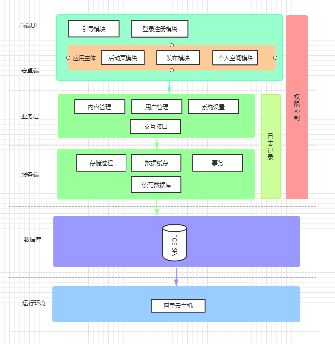

# 软件设计文档

## 引言

### 编写目的

    本文档主要为了方便前后端开发者、数据库开发者协调对接，将各个系统模块拆解展示内部结构，使开发者对整个软件架构体系有一个清晰的认识，有利于系统开发和后面运营、维护工作的进行。

### 系统说明

本应用主要包括以下几个部分：

| 子系统 | 参与开发人员 | 目标用户 |
| ------ | ------ | ------ | 
| Jingle 安卓端 | 李杰泓、吴啸林 | 所有客户端用户群体 |
| Jingle 服务端 | 鞠擘、王永杰 | 前端开发人员 |
| Jingle 数据库 | 王培钰 | 服务端开发人员 |

### 术语

## 软件结构

### 系统结构图

### 模块清单

| 模块编号 | 模块名称 | 模块标识符 |
| ------ | ------ | ------ | 
| 1 | 首次启动引导模块 | GuideActivity |
| 2 | 用户系统模块 | UserSystem |
| 3 | 鉴权服务模块 | AuthenticationService |
| 4 | 发布任务模块 | PublishActivity |
| 5 | 数据接口模块 | DataAPIService |
| 6 | 校园认证模块 | CertificationActivity |
| 7 | 名片设置模块 | ProfileSetting |
| 8 | 消息通知模块 | MessageService |
| 9 | 钱包充值提现模块 | WalletService |
| 10 | 底层数据存取模块 | DatabaseService |

## 模块设计

### GuideActivity

1. 概述

    引导页主要用于用户安装 app 之后首次打开应用时提供一个产品介绍以及简单的使用方法说明，目的是让用户能够快速上手，并提供精美的引导UI，给用户营造良好的使用感受。

2. 输入/输出项

3. 数据结构

4. 算法

5. 限制条件

    仅在安装 app 之后首次打开应用才会

### UserSystem

1. 概述

2. 输入/输出项

3. 数据结构

4. 算法

5. 限制条件

### AuthenticationService

1. 概述

2. 输入/输出项

3. 数据结构

4. 算法

5. 限制条件

### PublishActivity

1. 概述

2. 输入/输出项

3. 数据结构

4. 算法

5. 限制条件

### DataAPIService

1. 概述

2. 输入/输出项

3. 数据结构

4. 算法

5. 限制条件

### CertificationActivity

1. 概述

2. 输入/输出项

3. 数据结构

4. 算法

5. 限制条件

### ProfileSetting

1. 概述

2. 输入/输出项

3. 数据结构

4. 算法

5. 限制条件

### MessageService

1. 概述

2. 输入/输出项

3. 数据结构

4. 算法

5. 限制条件

### WalletService

1. 概述

2. 输入/输出项

3. 数据结构

4. 算法

5. 限制条件

### DatabaseService

1. 概述

2. 输入/输出项

3. 数据结构

4. 算法

5. 限制条件

